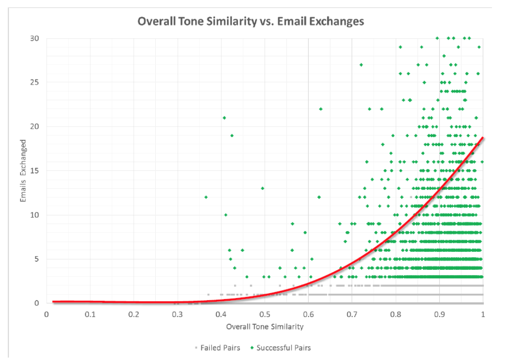

---

copyright:
  years: 2015, 2017
lastupdated: "2017-08-08"

---

{:shortdesc: .shortdesc}
{:new_window: target="_blank"}
{:tip: .tip}
{:pre: .pre}
{:codeblock: .codeblock}
{:screen: .screen}
{:javascript: .ph data-hd-programlang='javascript'}
{:java: .ph data-hd-programlang='java'}
{:python: .ph data-hd-programlang='python'}
{:swift: .ph data-hd-programlang='swift'}

# Case studies

Read these case studies to get inspiration for what you can do with the {{site.data.keyword.toneanalyzerfull}} service. The studies describe the correlation between reported tones and expected outcomes. For most studies, IBM measured correlation as a number between 0 and 1, with 1 being a perfect correlation and 0 being no correlation.
{: shortdesc}

## Predicting customer satisfaction in support forums

IBM analyzed customer support forums at a software company that is focused on multiple industries. The company actively contributes to customer support forums. Users can give *Kudos* to answers that they find useful.

### Goals

Predict customer satisfaction from the tone of the question and response. IBM assumed that an answer with Kudos meant that the user was satisfied.

### Actions

-   Crawled the most recent 1000 threads from several forums, making sure to include the same number of responses with and without Kudos.
-   Analyzed both the questions and the responses.
-   Applied several state-of-the-art classifiers, such as naive Bayes, Support Vector Machine (SVM), and random forest, to predict whether an answer would receive Kudos.

### Results

The service can predict Kudos with 66-percent accuracy. IBM found the following correlations between the tones that a forum response returns and whether that reply receives Kudos:

-   The more confident a response is, the more likely it is to earn Kudos (correlation of 0.23 between a high-value score on confidence and Kudos).
-   The more tentative a response is, the less likely it is to earn Kudos (negative correlation of -0.27 between a high-value score on tentative and Kudos).
-   The more open a response is, the more likely it is to earn Kudos (correlation of 0.10 between a high-value score on openness and Kudos).
-   The more organized, thoughtful, and thorough a response is, the more likely it is to earn Kudos (correlation of 0.10 between a high-value score on conscientiousness and Kudos).

## Predicting customer satisfaction in Twitter responses

Many companies are switching their customer support to Twitter. Twitter allows real-time answers, which helps to establish the brand as one with real people who care about their clients.

IBM analyzed 333 customer support conversations on Twitter. The customers were satisfied with 240 of the conversations and not happy with 93 of the interactions. IBM measured satisfaction by reading through the conversations and labeling them. Responses were labeled "customer satisfied" when they solved the problem and the client seemed satisfied; they were labeled "customer not satisfied" when the problem was not addressed to the client's satisfaction.

### Goals

Validate whether the tone of the conversations between the agent and the customer had any effect on overall customer satisfaction. Also identify the tone features that significantly impact customer satisfaction.

### Actions

-   Stripped punctuation, mentions, and links from the tweets.
-   Split each interaction into customer tweets and support tweets.
-   Analyzed each side of the conversation with the {{site.data.keyword.toneanalyzershort}} service, and compared the results to find correlations.

### Results

The service can predict customer satisfaction from the tone of the response with 67-percent accuracy. IBM identified the following correlations between the tone of customer service tweets and whether the client was satisfied with the response:

-   Customer support representatives who act disgusted in their tweets are less likely to satisfy the customer (negative correlation of -0.155 between a high-value score on disgust in a customer service tweet and customer satisfaction).
-   Customer support representatives who seem frustrated, angry, stressed, or insecure are less likely to satisfy the customer (negative correlation of -0.186 between a high-value score on emotional range in a customer service tweet and customer satisfaction).

IBM discovered the following correlations between the tone of customer tweets and whether the customer was satisfied with the response:

-   The angrier customers are, the less likely they are to be satisfied with the response (negative correlation of -0.198 between a high-value score on anger in a customer tweet and customer satisfaction).
-   The more disgusted customers are, the less likely they are to be satisfied with the response (negative correlation of -0.184 between a high-value score on disgust in a customer tweet and customer satisfaction).
-   The more organized, thoughtful, and thorough customers' tweets are, the more likely they are to be satisfied with the response (correlation of 0.177 between a high-value score on conscientiousness in a customer tweet and customer satisfaction).

## Predicting TED Talk applause

TED is a nonprofit organization that runs global conferences with the slogan "Ideas worth spreading." TED Talk speakers have 18 minutes to use innovative and engaging storytelling to address a wide range of topics within the research and practice of science and culture. Not all TED Talks are popular, and one way of measuring audience satisfaction with a talk is to measure the amount of applause it receives.

### Goals

Discover which tone patterns in TED Talks lead to applause and which patterns do not. Also predict applause based on the tone of a sentence.

### Actions

Sentences that received applause were already tagged in the data set.

-   Reviewed 1931 TED Talks.
-   Categorized as "applause text" a sentence tagged with "Applause." Also tagged the three sentences before the sentence with "applause text" and the three sentences after it with "non-applause text."
-   Analyzed both applause and non-applause text with the {{site.data.keyword.toneanalyzershort}} service.
-   Based on the correlations that were found, created classifiers to predict applause in other TED Talks based on their tone.

### Results

The service can predict applause with 75-percent accuracy. IBM found the following correlations between the tone of each set of sentences and whether those sentences received applause:

-   The more disgusted a speaker is, the less likely they are to receive applause (negative correlation of -0.066 between a high-value score on disgust and applause).
-   The more sadness a speaker expresses, the less likely they are to receive applause (negative correlation of -0.055 between a high-value score on sadness and applause).
-   The more emotionless or impersonal a speaker seems, the less likely they are to receive applause (negative correlation of -0.29 between a high-value score on analytical and applause).
-   The more joyful, contented, and satisfied a speaker seems, the more likely they are to receive applause (correlation of 0.21 between a high-value score on joy and applause).
-   The more organized, thoughtful, and thorough a speaker seems, the more likely they are to receive applause (correlation of 0.0964 between a high-value score on conscientiousness and applause).
-   The more engaging, sociable, and outgoing a speaker seems, the more likely they are to receive applause (correlation of 0.0942 between a high-value score on extraversion and applause).
-   The more caring, sympathetic, and trustworthy a speaker seems, the more likely they are to receive applause (correlation of 0.068 between a high-value score on agreeableness and applause).
-   The more concerned, passionate, and fierce a speaker seems, the more likely they are to receive applause (correlation of 0.064 between a high-value score on emotional range and applause).

## Predicting Twitter retweets and likes

Establishing a brand on Twitter is becoming a requirement for companies to succeed. An essential part of establishing you or your company as worth following is creating tweets that garner many likes and retweets.

### Goals

Find correlations between the tone of a tweet and whether that tweet is liked or retweeted.

### Actions

-   Crawled 5881 tweets from several business accounts on Twitter.
-   Stripped punctuation, mentions, and links from the tweets.
-   Analyzed each tweet with the {{site.data.keyword.toneanalyzershort}} service, and compared the results to find correlations.

### Results

IBM found the following correlations between the tone of a tweet and whether it is liked:

-   The more imaginative, open to change, or emotionally aware a tweet seems, the more likely it is to be liked (correlation of 0.02 between a high-value score on openness and likes).
-   The more organized, thoughtful, or thorough a tweet seems, the more likely it is to be liked (correlation of 0.03 between a high-value score on consciousness and likes).
-   The angrier, more stressed, or impulsive a tweet seems, the less likely it is to be retweeted (negative correlation of -0.02 between a high-value score on emotional range and likes).

IBM found the following correlations between the tone of a tweet and whether it is retweeted:

-   The more imaginative, open to change, or emotionally aware a tweet seems, the more likely it is to be retweeted (correlation of 0.05 between a high-value score on openness and retweets).
-   The more organized, thoughtful, or thorough a tweet seems, the more likely it is to be retweeted (correlation of 0.03 between a high-value score on consciousness and retweets).
-   The angrier, more stressed, or impulsive a tweet seems, the less likely it is to be retweeted (negative correlation of -0.033 between a high-value score on emotional range and retweets).

## Predicting online dating matches

Millions of people around the world use online dating to meet that special someone. People use online dating to find others who have much in common with them and to market themselves as potential partners.

### Goals

Correlate the tone of an individual's profile with the tone of a potential match's profile. Also discover whether that correlation would predict match success.

### Actions

-   Crawled approximately 50,000 user profiles.
-   Analyzed each profile with the {{site.data.keyword.toneanalyzershort}} service.
-   Defined potential matches as those who communicated through the site.
-   Compared the tone analysis of potential matches to find correlations.
-   Developed a statistical model from the tone similarity of the profiles to predict whether two users would communicate. Then compared the model to multiple baselines that consider other attributes such as demographics.

### Results

Tone similarity between profiles can make a 45-percent improvement in predicting whether two users will communicate as compared to predictors that dating websites regularly use. IBM discovered a strong overall correlation between tone similarity and the number of messages exchanged, as shown in the following image.

