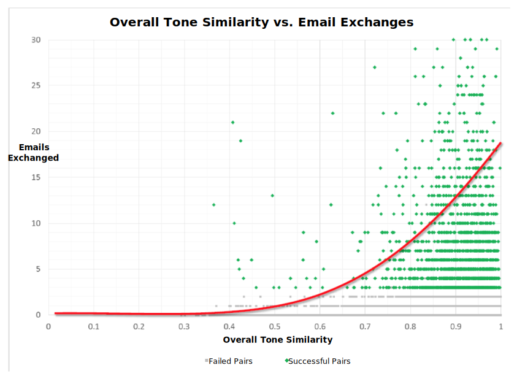

---

copyright:
  years: 2015, 2018
lastupdated: "2018-06-12"

---

{:shortdesc: .shortdesc}
{:new_window: target="_blank"}
{:tip: .tip}
{:pre: .pre}
{:important: .important}
{:note: .note}
{:deprecated: .deprecated}
{:codeblock: .codeblock}
{:screen: .screen}
{:javascript: .ph data-hd-programlang='javascript'}
{:java: .ph data-hd-programlang='java'}
{:python: .ph data-hd-programlang='python'}
{:swift: .ph data-hd-programlang='swift'}

# Case studies
{: #caseStudies}

Read these case studies to get inspiration for what you can do with the {{site.data.keyword.toneanalyzerfull}} service. The studies describe the correlation between reported tones and expected outcomes. Correlation can be positive or negative and has a range of -1.0 to 1.0.
{: shortdesc}

## Predicting customer satisfaction in support forums
{: #supportForums}

IBM analyzed customer support forums at a software company that is focused on multiple industries. The company actively contributes to customer support forums. Users can give *Kudos* to answers that they find useful.

### Goals
{: #supportForumsGoals}

Predict customer satisfaction from the tone of the question and response. IBM assumed that an answer with Kudos meant that the user was satisfied.

### Actions
{: #supportForumsActions}

-   Crawled the most recent 1000 threads from several forums, making sure to include the same number of responses with and without Kudos.
-   Analyzed both the questions and the responses.
-   Applied several state-of-the-art classifiers, such as naive Bayes, Support Vector Machine (SVM), and random forest, to predict whether an answer would receive Kudos.

### Results
{: #supportForumsResults}

The service can predict Kudos with 66-percent accuracy. IBM found the following correlations between the tones of a forum response and whether that reply receives Kudos:

-   The more confident a response is, the more likely it is to earn Kudos (correlation of 0.23 between a high-value score on confidence and Kudos).
-   The more tentative a response is, the less likely it is to earn Kudos (negative correlation of -0.27 between a high-value score on tentative and Kudos).

## Predicting customer satisfaction in Twitter responses
{: #twitterResponses}

Many companies are switching their customer support to Twitter. Twitter allows real-time answers, which helps to establish the brand as one with real people who care about their clients.

IBM analyzed 333 customer support conversations on Twitter. The customers were satisfied with 240 of the conversations and not happy with 93 of the interactions. IBM measured satisfaction by reading through the conversations and labeling them. Responses were labeled "customer satisfied" when they solved the problem and the client seemed satisfied. They were labeled "customer not satisfied" when the problem was not addressed to the client's satisfaction.

### Goals
{: #twitterResponsesGoals}

Validate whether the tone of the conversation between the agent and the customer affected overall customer satisfaction. Also, identify the tone features that significantly impact customer satisfaction.

### Actions
{: #twitterResponsesActions}

-   Stripped punctuation, mentions, and links from the tweets.
-   Split each interaction into customer tweets and support tweets.
-   Analyzed each side of the conversation with the {{site.data.keyword.toneanalyzershort}} service, and compared the results to find correlations.

### Results
{: #twitterResponsesResults}

The service can predict customer satisfaction from the tone of the response with 67-percent accuracy. IBM discovered the following correlation between the tone of customer tweets and whether the customer was satisfied with the response:

-   The angrier that customers are, the less likely they are to be satisfied with the response. A negative correlation of -0.198 exists between a high-value score on anger in a customer tweet and customer satisfaction.

## Predicting TED Talk applause
{: #tedTalks}

TED is a nonprofit organization that runs global conferences with the slogan "Ideas worth spreading." TED Talk speakers have 18 minutes to use innovative and engaging storytelling to address a wide range of topics within the research and practice of science and culture. Not all TED Talks are popular, and one way of measuring audience satisfaction with a talk is to measure the amount of applause it receives.

### Goals
{: #tedTalksGoals}

Discover which tone patterns in TED Talks lead to applause and which patterns do not. Also, predict applause based on the tone of a sentence.

### Actions
{: #tedTalksActions}

Sentences that received applause were already tagged in the data set.

-   Reviewed 1931 TED Talks.
-   Categorized as "applause text" a sentence that is tagged with "Applause." Also tagged the three sentences before the sentence with "applause text" and the three sentences after it with "non-applause text."
-   Analyzed both applause and non-applause text with the {{site.data.keyword.toneanalyzershort}} service.
-   Based on the correlations that were found, created classifiers to predict applause in other TED Talks based on their tone.

### Results
{: #tedTalksResults}

The service can predict applause with 75-percent accuracy. IBM found the following correlations between the tone of each set of sentences and whether those sentences received applause:

-   The more sadness a speaker expresses, the less likely they are to receive applause (negative correlation of -0.055 between a high-value score on sadness and applause).
-   The more emotionless or impersonal a speaker seems, the less likely they are to receive applause (negative correlation of -0.29 between a high-value score on analytical and applause).
-   The more joyful, contented, and satisfied a speaker seems, the more likely they are to receive applause (correlation of 0.21 between a high-value score on joy and applause).

## Predicting Twitter retweets and likes
{: #twitterRetweets}

Establishing a brand on Twitter is becoming a requirement for companies to succeed. An essential part of establishing you or your company as worth following is creating tweets that garner many likes and retweets.

### Goals
{: #twitterRetweetsGoals}

Find correlations between the tone of a tweet and whether that tweet is liked or retweeted.

### Actions
{: #twitterRetweetsActions}

-   Crawled 5881 tweets from several business accounts on Twitter.
-   Stripped punctuation, mentions, and links from the tweets.
-   Analyzed each tweet with the {{site.data.keyword.toneanalyzershort}} service, and compared the results to find correlations.

### Results
{: #twitterRetweetsResults}

IBM found correlations between the tone of a tweet and whether it is liked, and  between the tone of a tweet and whether it is retweeted.

## Predicting online dating matches
{: #onlineDating}

Millions of people around the world use online dating to meet that special someone. People use online dating to find others who have much in common with them and to market themselves as potential partners.

### Goals
{: #onlineDatingGoals}

Correlate the tone of an individual's profile with the tone of a potential match's profile. Also, discover whether that correlation predicts match success.

### Actions
{: #onlineDatingActions}

-   Crawled approximately 50,000 user profiles.
-   Analyzed each profile with the {{site.data.keyword.toneanalyzershort}} service.
-   Defined potential matches as those users who communicated through the site.
-   Compared the tone analysis of potential matches to find correlations.
-   Developed a statistical model from the tone similarity of the profiles to predict whether two users would communicate. Then, compared the model to multiple baselines that consider other attributes such as demographics.

### Results
{: #onlineDatingResults}

Tone similarity between profiles can make a 45-percent improvement in predicting whether two users communicate as compared to predictors that dating websites regularly use. IBM discovered a strong overall correlation between tone similarity and the number of messages that are exchanged, as shown in the following image.

