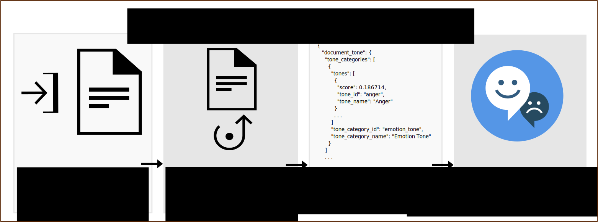

---

copyright:
  years: 2015, 2018
lastupdated: "2018-11-02"

---

{:shortdesc: .shortdesc}
{:new_window: target="_blank"}
{:tip: .tip}
{:pre: .pre}
{:codeblock: .codeblock}
{:screen: .screen}
{:javascript: .ph data-hd-programlang='javascript'}
{:java: .ph data-hd-programlang='java'}
{:python: .ph data-hd-programlang='python'}
{:swift: .ph data-hd-programlang='swift'}

# About
{: #about}

> **Service update:** *The {{site.data.keyword.toneanalyzershort}} service was updated on October 30, 2018. The service now uses {{site.data.keyword.Bluemix}} Identity and Access Management (IAM) authentication in all locations. (The service continues to use Cloud Foundry service credentials in the Frankfurt location; this location will migrate to IAM authentication as soon as possible.) For more information, see the [October 30 2018 service update](/docs/services/tone-analyzer/release-notes.html#October2018) in the release notes.*

The {{site.data.keyword.toneanalyzerfull}} service uses linguistic analysis to detect emotional and language tones in written text. The service can analyze tone at both the document and sentence levels. You can use the service to understand how your written communications are perceived and then to improve the tone of your communications. Businesses can use the service to learn the tone of their customers' communications and to respond appropriately to each customer, or to understand and improve their customer conversations in general.
{: shortdesc}

You submit JSON, plain text, or HTML input that contains your written content to the service. The service accepts up to 128 KB of text, which is about 1000 sentences. The service returns JSON results that report the tone of your input. You can use these results to improve the perception and effectiveness of your communications, ensuring that your writing conveys the tone and style that you want for your intended audience. The following diagram shows the basic flow of calls to the service.

## Tone Analyzer endpoints

The service offers two endpoints:

-   **General-purpose endpoint** (`GET` or `POST /v3/tone`)

    Use the {{site.data.keyword.toneanalyzershort}} general-purpose endpoint to analyze shorter web data, such as email messages or tweets, or longer documents, such as articles or blog posts. Monitor social media to understand what customers are saying about a brand and to determine whom to target with specific messaging. The endpoint accepts JSON, plain text, or HTML input. For more information about the method and the tones that it returns, see [Using the general-purpose endpoint](/docs/services/tone-analyzer/using-tone.html).

    The [general-purpose demo ](https://tone-analyzer-demo.ng.bluemix.net/){: new_window} submits content to the service for analysis. The service returns overall and sentence-level analyses of the tone of the content.
-   **Customer-engagement endpoint** (`POST /v3/tone_chat`)

    Use the {{site.data.keyword.toneanalyzershort}} customer-engagement endpoint to monitor customer service and support conversations. Escalate customer conversations when they turn sour or find opportunities to improve customer service scripts, dialog strategies, and customer journeys. The endpoint accepts JSON input. For more information about the method and the tones that it returns, see [Using the customer-engagement endpoint](/docs/services/tone-analyzer/using-tone-chat.html).

    The [customer-engagement demo ](https://customer-engagement-demo.ng.bluemix.net/){: new_window} analyzes conversations between customers and customer service agents. The service measures customer satisfaction and concerns, and assesses agent performance, so that you can gauge how the interaction evolves.

For more information about the pricing plans available for the service, see the [{{site.data.keyword.toneanalyzershort}} service in the {{site.data.keyword.Bluemix_short}} Catalog ](https://console.ng.bluemix.net/catalog/services/tone-analyzer){: new_window}.

## Use cases

Some interesting use cases of the service are

-   *Social listening and audience monitoring* - Monitor social media to understand what customers are saying about your brand in real time. For example, you might determine that your customers in Chicago are sad after the Bulls lost or happy during the Taste of Chicago festival. (General-purpose endpoint)
-   *Personalized marketing* - Determine whom to target with personalized messaging and when. For example, a travel company might target happy consumers with "treat yourself" messaging, sad consumers with "escape" messaging, and angry consumers with "relax" messaging. (General-purpose endpoint)
-   *Chat bots* - Enable an automated agent to detect customer tones and craft suitable responses. For example, you might respond to sadness with "I'm sorry you are upset about this problem" or to satisfaction with "I'm glad you are satisfied with our service." (Customer-engagement endpoint)
-   *Customer-engagement monitoring and quality assurance* - Monitor the overall tone of agent and customer communications, detect anomalies, and highlight opportunities to train agents on how to better communicate. (Customer-engagement endpoint)

You can also use the {{site.data.keyword.toneanalyzershort}} service to analyze user input with other {{site.data.keyword.ibmwatson_notm}} services such as [{{site.data.keyword.conversationfull}}](https://console.bluemix.net/docs/services/conversation/index.html) or [{{site.data.keyword.speechtotextfull}}](https://console.bluemix.net/docs/services/speech-to-text/index.html). For instance, the [Conversation Food Coach ](https://food-coach.ng.bluemix.net/){: new_window} application uses the {{site.data.keyword.conversationshort}} service to coach users to make healthy food choices based on their responses about the food that they eat. For more information, see this [Watson blog post ](https://developer.ibm.com/watson/blog/2016/10/17/creating-a-compassionate-conversational-agent-using-watson-tone-analyzer-and-watson-conversation-services/){: new_window}.

> **Note:** The {{site.data.keyword.toneanalyzershort}} service algorithmically calculates the tone of written text. It does not infer the personality characteristics of the author of the text. To obtain a personality portrait, see the [{{site.data.keyword.personalityinsightsfull}} service ](https://console.bluemix.net/docs/services/personality-insights/index.html){: new_window}.

## Language support
{: #languages}

The `/v3/tone` and `/v3/tone_chat` methods can analyze content in English (`en`) and French (`fr`). Both methods can respond with localized content in various languages. For more information, see [Using the general-purpose endpoint](/docs/services/tone-analyzer/using-tone.html) and [Using the customer-engagement endpoint](/docs/services/tone-analyzer/using-tone-chat.html).
