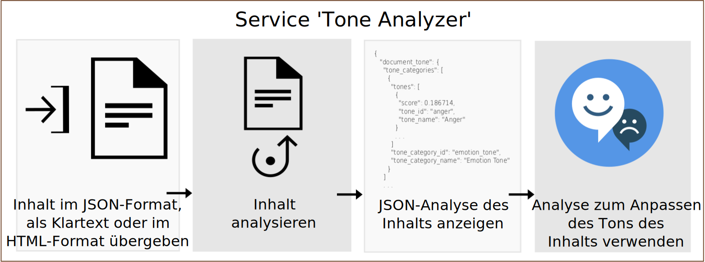

---

copyright:
  years: 2015, 2019
lastupdated: "2019-03-27"

subcollection: tone-analyzer

---

{:shortdesc: .shortdesc}
{:new_window: target="_blank"}
{:tip: .tip}
{:important: .important}
{:note: .note}
{:deprecated: .deprecated}
{:pre: .pre}
{:codeblock: .codeblock}
{:screen: .screen}
{:javascript: .ph data-hd-programlang='javascript'}
{:java: .ph data-hd-programlang='java'}
{:python: .ph data-hd-programlang='python'}
{:swift: .ph data-hd-programlang='swift'}

# Produktinformation
{: #about}

> **Serviceaktualisierung:** *Der Service {{site.data.keyword.toneanalyzershort}} wurde am 22. Februar 2019 aktualisiert. Der Service verwendet nun am {{site.data.keyword.cloud}}-Standort Frankfurt (**eu-de**) die tokenbasierte Authentifizierung von Identity and Access Management (IAM). Weitere Informationen finden Sie in den Releaseinformationen unter [Serviceaktualisierung vom 22. Februar 2019](/docs/services/tone-analyzer?topic=tone-analyzer-rnrn#February2019).*

Der Service {{site.data.keyword.toneanalyzerfull}} verwendet linguistische Analysefunktionen, um emotionale und Sprachtöne in schriftlichen Texten zu erkennen. Der Service kann Töne auf Dokument- und Satzebene analysieren. Sie können mithilfe des Service verstehen, wie Ihre schriftliche Kommunikation wahrgenommen wird, und dann den Ton Ihrer Kommunikation verbessern. Unternehmen können mithilfe des Service den Ton der Kommunikation ihrer jeweiligen Kunden erlernen und jedem Kunden in der entsprechenden Weise antworten oder generell die Konversation mit ihren Kunden verstehen und verbessern.
{: shortdesc}

Sie übergeben an den Service Eingaben in JSON, Klartext oder HTML, die Ihren schriftlichen Inhalt enthalten. Der Service akzeptiert bis zu 128 KB Text. Das entspricht etwa 1000 Sätzen. Der Service gibt JSON-Ergebnisse zurück, die den Ton Ihrer Eingabe dokumentieren. Sie können aufgrund dieser Ergebnisse die Wahrnehmung und Effektivität Ihrer Kommunikation verbessern und dadurch sicherstellen, dass Ihre schriftlichen Äußerungen den für Ihre Zielgruppe gewünschten Ton und Stil aufweisen. Nachstehend finden Sie ein Diagramm mit den grundlegenden Abläufen von Aufrufen des Service.

## Endpunkte von Tone Analyzer
{: #itae}

Der Service bietet zwei Endpunkte:

-   **Endpunkt für allgemeine Zwecke** (`GET` oder `POST /v3/tone`)

    Mit dem Endpunkt für allgemeine Zwecke von {{site.data.keyword.toneanalyzershort}} können Sie kürzere Webdaten wie E-Mail-Nachrichten oder Tweets bzw. längere Dokumente wie Artikel oder Blogbeiträge analysieren. Sie können soziale Medien überwachen, um zu verstehen, wie sich Kunden über eine Marke äußern, und zu bestimmen, wem Sie personalisierte Nachrichten zukommen lassen wollen. Der Endpunkt akzeptiert Eingaben in JSON, Klartext oder HTML. Weitere Informationen zu der Methode und den von ihr zurückgegebenen Tönen finden Sie im Abschnitt [Endpunkt für allgemeine Zwecke verwenden](/docs/services/tone-analyzer?topic=tone-analyzer-utgpe).

    In der [Demo für allgemeine Zwecke ](https://tone-analyzer-demo.ng.bluemix.net/){: new_window} werden Inhalte zur Analyse an den Service übergeben. Der Service gibt die Gesamtanalyse sowie die Analyse des Tons des Inhalts auf Satzebene zurück.
-   **Endpunkt für Kundenengagement** (`POST /v3/tone_chat`)

    Mit dem Endpunkt für Kundenengagement von {{site.data.keyword.toneanalyzershort}} können Sie Konversationen des Kundenservice und der Kundenunterstützung überwachen. Sie können Konversationen mit Kunden eskalieren, wenn diese einen ungünstigen Verlauf nehmen, oder nach Möglichkeiten suchen, Scripts, Dialogstrategien und Customer Journeys des Kundenservice zu verbessern. Der Endpunkt akzeptiert JSON-Eingaben. Weitere Informationen zu der Methode und den von ihr zurückgegebenen Tönen finden Sie im Abschnitt [Endpunkt für Kundenengagement verwenden](/docs/services/tone-analyzer?topic=tone-analyzer-utco).

    In der [Demo für das Kundenengagement ](https://customer-engagement-demo.ng.bluemix.net/){: new_window} werden Konversationen zwischen Kunden und Kundendienstmitarbeitern analysiert. Der Service misst die Zufriedenheit des Kunden und dessen Probleme und beurteilt die Leistung des Mitarbeiters, sodass Sie einschätzen können, wie sich die Interaktion weiterentwickelt.

Weitere Informationen zu den für den Service verfügbaren Preistarifen finden Sie im Service {{site.data.keyword.toneanalyzershort}} im [{{site.data.keyword.cloud_notm}}-Katalog ](https://{DomainName}/catalog/services/tone-analyzer){: new_window}.

## Anwendungsfälle
{: #iuc}

Nachstehend finden Sie einige interessante Anwendungsfälle des Service:

-   *Social-Media-Listening und Zielgruppenüberwachung* - Sie können die sozialen Medien in Echtzeit überwachen, um Kundenäußerungen zu Ihrer Marke zu untersuchen. Sie könnten beispielsweise feststellen, dass Ihre Kunden in München nach einer Niederlage der Bayern traurig und während des Oktoberfests glücklich sind. (Endpunkt für allgemeine Zwecke)
-   *Personalisiertes Marketing* - Sie können bestimmen, wann und wem Sie personalisierte Nachrichten übermitteln. Ein Reiseveranstalter beispielsweise könnte glücklichen Kunden Nachrichten vom Typ "Belohnen Sie sich mit ...", traurigen Kunden Nachrichten vom Typ "Lassen Sie ... hinter sich" und verärgerten Kunden Nachrichten vom Typ "Sehen Sie's locker" schicken. (Endpunkt für allgemeine Zwecke)
-   *Chatbots* - Sie können einen automatisierten Mitarbeiter befähigen, Töne von Kunden zu erkennen und passende Antworten zu generieren. Sie könnten beispielsweise auf Traurigkeit mit "Es tut mir leid, dass Sie sich über dieses Problem ärgern" antworten und auf Zufriedenheit mit "Ich freue mich, dass Sie mit unserem Service zufrieden sind". (Endpunkt für das Kundenengagement)
-   *Überwachung von Kundenengagements und Qualitätssicherung* - Sie können den Gesamtton der Kommunikation zwischen Mitarbeitern und Kunden überwachen, Anomalien erkennen und Gelegenheiten zur Schulung von Mitarbeitern markieren, um deren Kommunikation zu verbessern. (Endpunkt für das Kundenengagement)

Sie können den Service {{site.data.keyword.toneanalyzershort}} auch zum Analysieren der Benutzereingabe mit anderen {{site.data.keyword.ibmwatson}}-Services wie beispielsweise [{{site.data.keyword.conversationfull}}](https://{DomainName}/docs/services/conversation/index.html) oder [{{site.data.keyword.speechtotextfull}}](https://{DomainName}/docs/services/speech-to-text/index.html) verwenden. Die Anwendung [Conversation Food Coach ](https://food-coach.ng.bluemix.net/){: new_window} beispielsweise schult mithilfe des Service {{site.data.keyword.conversationshort}} Nutzer auf der Basis ihrer Antworten bezüglich der Lebensmittel, die sie essen, beim Treffen gesundheitsorientierter Entscheidungen zu Lebensmitteln. Weitere Informationen finden Sie in diesem [{{site.data.keyword.watson}}-Blogbeitrag ](https://developer.ibm.com/watson/blog/2016/10/17/creating-a-compassionate-conversational-agent-using-watson-tone-analyzer-and-watson-conversation-services/){: new_window}.

Der Service {{site.data.keyword.toneanalyzershort}} berechnet mithilfe von Algorithmen den Ton schriftlicher Texte. Er leitet nicht die Persönlichkeitsmerkmale des Verfassers des Texts ab. Informationen zur Erstellung eines Persönlichkeitsportraits finden Sie im [Service {{site.data.keyword.personalityinsightsfull}} ](https://{DomainName}/docs/services/personality-insights/index.html){: new_window}.
{: note}

## Sprachunterstützung
{: #languages}

Die Methoden `/v3/tone` und `/v3/tone_chat` können Inhalte auf Englisch (`en`) und Französisch (`fr`) analysieren. Beide Methoden können in verschiedenen Sprachen mit lokalisiertem Inhalt antworten. Weitere Informationen finden Sie in den Abschnitten [Endpunkt für allgemeine Zwecke verwenden](/docs/services/tone-analyzer?topic=tone-analyzer-utgpe) und [Endpunkt für Kundenengagement verwenden](/docs/services/tone-analyzer?topic=tone-analyzer-utco).

## HIPAA
{: #hipaa}

Die HIPAA-Unterstützung (HIPAA = Health Insurance Portability and Accountability Act; Gesetz zur Übertragbarkeit und Verantwortlichkeit der Krankenversicherung) gilt für den Service {{site.data.keyword.toneanalyzershort}} nicht. Bei dem Service handelt es sich um einen statusunabhängigen Service. Es werden keine Benutzerdaten in {{site.data.keyword.cloud_notm}} gespeichert.
