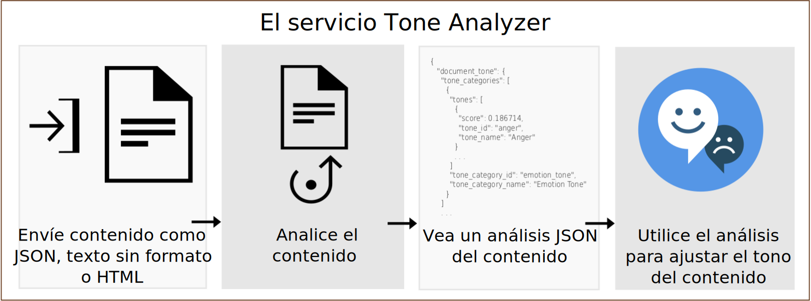

---

copyright:
  years: 2015, 2019
lastupdated: "2019-03-27"

subcollection: tone-analyzer

---

{:shortdesc: .shortdesc}
{:new_window: target="_blank"}
{:tip: .tip}
{:important: .important}
{:note: .note}
{:deprecated: .deprecated}
{:pre: .pre}
{:codeblock: .codeblock}
{:screen: .screen}
{:javascript: .ph data-hd-programlang='javascript'}
{:java: .ph data-hd-programlang='java'}
{:python: .ph data-hd-programlang='python'}
{:swift: .ph data-hd-programlang='swift'}

# Acerca de
{: #about}

> **Actualización del servicio:** *El servicio {{site.data.keyword.toneanalyzershort}} se ha actualizado el 22 de febrero de 2019. El servicio ahora utiliza la autenticación de IAM (Identity and Access Management) basada en señales en la {{site.data.keyword.cloud}} ubicación de Frankfurt (**eu-de**). Para obtener más información, consulte la [actualización de servicio del 22 de febrero de 2019](/docs/services/tone-analyzer?topic=tone-analyzer-rnrn#February2019) en las notas del release.*

El servicio {{site.data.keyword.toneanalyzerfull}} utiliza el análisis lingüístico para detectar tonos emocionales y de lenguaje en texto escrito. El servicio puede analizar el tono a nivel de documento y de frase. Puede utilizar el servicio para comprender cómo se perciben sus comunicaciones por escrito y mejorar el tono de sus comunicaciones. Las empresas pueden utilizar el servicio para obtener el tono de las comunicaciones de sus clientes y responder adecuadamente a cada cliente, o para comprender y mejorar las conversaciones con los clientes en general.
{: shortdesc}

Se envía al servicio entrada JSON, de texto sin formato o HTML con el contenido escrito. El servicio acepta hasta 128 KB de texto, lo que equivale a unas 1000 frases. El servicio devuelve resultados JSON que indican el tono de la entrada. Puede utilizar estos resultados para mejorar la percepción y la eficacia de sus comunicaciones, asegurándose de que sus escritos se ajustan al tono y al estilo que desea para el público al que va destinado. En el diagrama siguiente se muestra el flujo básico de llamadas al servicio.

## Puntos finales de Tone Analyzer
{: #itae}

El servicio ofrece dos puntos finales:

-   **Punto final de finalidad general** (`GET` o `POST /v3/tone`)

    Utilice el punto final de finalidad general de {{site.data.keyword.toneanalyzershort}} para analizar datos web breves, como mensajes de correo electrónico o tweets, o documentos más largos, como artículos o publicaciones de blogs. Supervise las redes sociales para comprender lo que dicen los clientes sobre una marca y para determinar a quién debe dirigir un tipo determinado de mensajes. El punto final acepta entradas JSON, en texto sin formato o HTML. Para obtener más información sobre el método y los tonos que devuelve, consulte [Utilización del punto final de finalidad general](/docs/services/tone-analyzer?topic=tone-analyzer-utgpe).

    La [demo de finalidad general ](https://tone-analyzer-demo.ng.bluemix.net/){: new_window} envía contenido al servicio para su análisis. El servicio devuelve un análisis general y a nivel de frase del tono del contenido.
-   **Punto final de fidelización del cliente** (`POST /v3/tone_chat`)

    Utilice el punto final de fidelización del cliente de {{site.data.keyword.toneanalyzershort}} para analizar el servicio al cliente y las conversaciones de soporte. Puede transferir las conversaciones del cliente a otro nivel cuando el tono se vuelve más agrio o buscar oportunidades para mejorar los scripts del servicio de soporte, las estrategias de diálogo y la ruta de navegación del cliente. El punto final acepta entradas JSON. Para obtener más información sobre el método y los tonos que devuelve, consulte [Utilización del punto final de fidelización del cliente](/docs/services/tone-analyzer?topic=tone-analyzer-utco).

    La [demo de fidelización del cliente ](https://customer-engagement-demo.ng.bluemix.net/){: new_window} analiza conversaciones entre cliente y agentes del servicio al cliente. El servicio mide el nivel de satisfacción del cliente y sus preocupaciones y evalúa el rendimiento de los agentes, de forma que permite ver la evolución de la interacción.

Para obtener información sobre los planes de precios disponibles para el servicio, consulte el servicio {{site.data.keyword.toneanalyzershort}} del [Catálogo de {{site.data.keyword.cloud_notm}} ](https://{DomainName}/catalog/services/tone-analyzer){: new_window}.

## Casos prácticos
{: #iuc}

A continuación se muestran algunos casos prácticos interesantes del servicio:

-   *Supervisión de redes sociales y de audiencia* - Supervise las redes sociales para comprender lo que dicen los clientes sobre su marca en tiempo real. Por ejemplo, puede determinar que los clientes de Chicago están tristes después de que pierdan los Bulls o contentos durante el festival Taste of Chicago. (Punto final de finalidad general)
-   *Marketing personalizado* - Determine a quién y cuándo dirigir mensajes personalizados. Por ejemplo, una agencia de viajes puede dirigir a los clientes contentos el mensaje "mímese", a los clientes tristes el mensaje "escápese" y a los clientes enfadados el mensaje "relájese". (Punto final de finalidad general)
-   *Bots de chat* - Permite que un agente automático detecte tonos de los clientes y genere respuestas adecuadas. Por ejemplo, puede responder ante un tono triste con el mensaje "Sentimos que se haya producido este" o ante un tono de satisfacción con el mensaje "Nos alegramos de que esté satisfecho con nuestro servicio". (Punto final de fidelización del cliente)
-   *Supervisión de la fidelización del cliente y garantía de servicio* - Supervise el tono general de las comunicaciones entre un agente y un cliente, detecte anomalías y descubra oportunidades para formar a sus agentes para que mejoren su comunicación. (Punto final de fidelización del cliente)

También puede utilizar el servicio {{site.data.keyword.toneanalyzershort}} para analizar la entrada de usuario con otros servicios de {{site.data.keyword.ibmwatson}} como por ejemplo [{{site.data.keyword.conversationfull}}](https://{DomainName}/docs/services/conversation/index.html) o [{{site.data.keyword.speechtotextfull}}](https://{DomainName}/docs/services/speech-to-text/index.html). Por ejemplo, la aplicación [Conversation Food Coach ](https://food-coach.ng.bluemix.net/){: new_window} utiliza el servicio {{site.data.keyword.conversationshort}} para asesorar a los usuarios para que elijan alimentos saludables en sus respuestas sobre su tipo de alimentación. Para obtener más información, consulte esta [publicación del blog de {{site.data.keyword.watson}} ](https://developer.ibm.com/watson/blog/2016/10/17/creating-a-compassionate-conversational-agent-using-watson-tone-analyzer-and-watson-conversation-services/){: new_window}.

El servicio {{site.data.keyword.toneanalyzershort}} calcula el tono del texto escrito utilizando un algoritmo. No saca ninguna conclusión sobre la personalidad del autor del texto. Para obtener un perfil de personalidad, consulte el servicio [{{site.data.keyword.personalityinsightsfull}} ](https://{DomainName}/docs/services/personality-insights/index.html){: new_window}.
{: note}

## Soporte de idiomas
{: #languages}

Los métodos `/v3/tone` y `/v3/tone_chat` pueden analizar contenido en inglés (`en`) y en francés (`fr`). Ambos métodos pueden responder con contenido traducido en diversos idiomas. Para obtener más información, consulte [Utilización del punto final de finalidad general](/docs/services/tone-analyzer?topic=tone-analyzer-utgpe) y [Utilización del punto final de fidelización del cliente](/docs/services/tone-analyzer?topic=tone-analyzer-utco).

## HIPAA
{: #hipaa}

El soporte de HIPAA (US Health Insurance Portability and Accountability Act) no se aplica al servicio {{site.data.keyword.toneanalyzershort}}. El servicio es sin estado. No almacena ningún dato de usuario en {{site.data.keyword.cloud_notm}}.
