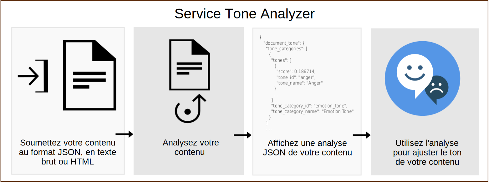

---

copyright:
  years: 2015, 2019
lastupdated: "2019-03-27"

subcollection: tone-analyzer

---

{:shortdesc: .shortdesc}
{:new_window: target="_blank"}
{:tip: .tip}
{:important: .important}
{:note: .note}
{:deprecated: .deprecated}
{:pre: .pre}
{:codeblock: .codeblock}
{:screen: .screen}
{:javascript: .ph data-hd-programlang='javascript'}
{:java: .ph data-hd-programlang='java'}
{:python: .ph data-hd-programlang='python'}
{:swift: .ph data-hd-programlang='swift'}

# A propos
{: #about}

> **Mise à jour du service :** *le service {{site.data.keyword.toneanalyzershort}} a été mis à jour le 22 février 2019. Le service utilise désormais une authentification IAM (Identity and Access Management) basée sur des jetons sur le site {{site.data.keyword.cloud}} de Francfort (**eu-de**). Pour plus d'informations, voir la [Mise à jour du service du 22 février 2019](/docs/services/tone-analyzer?topic=tone-analyzer-rnrn#February2019) dans les notes sur l'édition.*

Le service {{site.data.keyword.toneanalyzerfull}} utilise l'analyse linguistique pour détecter des tons d'émotion et du langage dans le texte écrit. Le service peut analyser le ton au niveau du document tout comme des phrases. Vous pouvez utiliser ce service pour comprendre comment vos communications écrites sont perçues et améliorer ensuite le ton de vos communications. Les entreprises peuvent utiliser le service pour identifier le ton des communications de leurs clients et répondre à chaque client en conséquence, ou pour améliorer leurs conversations avec les clients en général.
{: shortdesc}

Vous devez soumettre au service une entrée JSON, en texte brut ou HTML hébergeant votre contenu écrit. Le service accepte jusqu'à 128 Ko de texte, ce qui représente environ 1000 phrases. Le service renvoie des résultats JSON qui signalent le ton de votre entrée. Vous pouvez utiliser ces résultats pour améliorer la perception et l'efficacité de vos communications, en vous assurant que vos écrits véhiculent le ton et le style désiré pour votre public cible. Le diagramme suivant illustre le flux de base des appels au service.

## Noeuds finaux Tone Analyzer
{: #itae}

Le service offre deux noeuds finaux :

-   **Noeud final générique** (`GET` ou `POST /v3/tone`)

    Utilisez le noeud final générique {{site.data.keyword.toneanalyzershort}} pour analyser des données Web brèves, telles que des courriers électroniques ou des tweets, ou des documents plus longs, comme des articles ou des publications dans des blogues. Surveillez les médias sociaux pour comprendre ce que les clients expriment sur une marque et déterminer lesquels cibler avec des messages spécifiques. Le noeud final accepte des entrées JSON, en texte brut ou HTML. Pour plus d'informations sur la méthode et les tons renvoyés, voir [Utilisation du noeud final générique](/docs/services/tone-analyzer?topic=tone-analyzer-utgpe).

    La [démonstration générique ](https://tone-analyzer-demo.ng.bluemix.net/){: new_window} permet de soumettre un contenu au service pour son analyse. Le service renvoie une analyse au niveau global et au niveau des phrases du ton du contenu.
-   **Noeud final d'interaction avec les clients** (`POST /v3/tone_chat`)

    Utilisez le noeud final d'interaction avec les clients de {{site.data.keyword.toneanalyzershort}} pour surveiller les conversations avec le service client et le support. Escaladez les conversations avec les clients lorsqu'elles s’enveniment ou pour améliorer les scripts du service client, les stratégies de dialogue et les cheminements du client. Le noeud final accepte une entrée JSON. Pour plus d'informations sur la méthode et les tons renvoyés, voir [Utilisation du noeud final d'interaction avec les clients](/docs/services/tone-analyzer?topic=tone-analyzer-utco).

    La [démonstration d'interaction avec les clients ](https://customer-engagement-demo.ng.bluemix.net/){: new_window} analyse les conversations entre les clients et les agents du service client. Le service mesure la satisfaction et les préoccupations des clients et évalue les performances des agents afin de vous permettre de jauger l'évolution de l'interaction.

Pour plus d'informations sur les plans de tarification disponibles pour le service, voir le service {{site.data.keyword.toneanalyzershort}} dans le [catalogue {{site.data.keyword.cloud_notm}} ](https://{DomainName}/catalog/services/tone-analyzer){: new_window}.

## Scénarios d'utilisation
{: #iuc}

Quelques cas d’utilisation intéressants du service 

-   *Ecoute sociale et suivi d'audience* - Surveillez les médias sociaux pour comprendre ce que disent en temps réel les clients sur votre marque. Par exemple, vous pourriez constater que vos clients à Chicago sont tristes après une défaite des Bulls ou joyeux lors du festival Taste of Chicago. (Noeud final générique)
-   *Marketing personnalisé* - Déterminez quel public cibler avec des messages personnalisés et quand. Par exemple, un voyagiste pourrait cibler des clients joyeux avec un message "faites-vous plaisir", les clients tristes avec un message "échappez-vous" et les clients en colère avec un message "détendez-vous". (Noeud final générique)
-   *Agents conversationnels* - Activez un agent automatisé pour détecter les tons des clients et composer des réponses adaptées. Par exemple, vous pourriez répondre à de la tristesse par "Désolé que ce problème vous ait agacé" ou à de la satisfaction par "Content que vous soyez satisfait de notre service." (Noeud final d'interaction avec les clients)
-   *Surveillance de l'interaction avec les clients et assurance qualité* - Surveillez le ton global des communications entre les agents et les clients, détectez des anomalies et mettez en évidence des opportunités de former les agents afin de mieux communiquer. (Noeud final d'interaction avec les clients)

Vous pouvez également utiliser le service {{site.data.keyword.toneanalyzershort}} pour analyser les entrées utilisateur avec d'autres services {{site.data.keyword.ibmwatson}}, comme [{{site.data.keyword.conversationfull}}](https://{DomainName}/docs/services/conversation/index.html) ou [{{site.data.keyword.speechtotextfull}}](https://{DomainName}/docs/services/speech-to-text/index.html). Par exemple, l'application [Conversation Food Coach ](https://food-coach.ng.bluemix.net/){: new_window} utilise le service {{site.data.keyword.conversationshort}} pour inciter les utilisateurs à sélectionner des aliments sains compte tenu des réponses quant à la nourriture qu'ils consomment. Pour plus d'informations, reportez-vous à cet [article de blogue {{site.data.keyword.watson}} ](https://developer.ibm.com/watson/blog/2016/10/17/creating-a-compassionate-conversational-agent-using-watson-tone-analyzer-and-watson-conversation-services/){: new_window}.

Le service {{site.data.keyword.toneanalyzershort}} calcule le ton du texte écrit en faisant appel à un algorithme. Il ne déduit pas les caractéristiques de personnalité de l'auteur du texte. Pour obtenir un portait de personnalité, reportez-vous au [service {{site.data.keyword.personalityinsightsfull}} ](https://{DomainName}/docs/services/personality-insights/index.html){: new_window}.
{: note}

## Support de langue
{: #languages}

Les méthodes `/v3/tone` et `/v3/tone_chat` peuvent analyser un contenu en anglais (`en`) et en français (`fr`). Les deux méthodes peuvent répondre avec un contenu localisé en différentes langues. Pour plus d'informations, voir [Utilisation du noeud final générique](/docs/services/tone-analyzer?topic=tone-analyzer-utgpe) et [Utilisation du noeud final d'interaction avec les clients](/docs/services/tone-analyzer?topic=tone-analyzer-utco).

## HIPAA
{: #hipaa}

La prise en charge de la loi américaine HIPAA (Health Insurance Portability and Accountability Act) ne s’applique pas au service {{site.data.keyword.toneanalyzershort}}. Le service est sans état. Il ne stocke aucune donnée utilisateur sur {{site.data.keyword.cloud_notm}}. 
