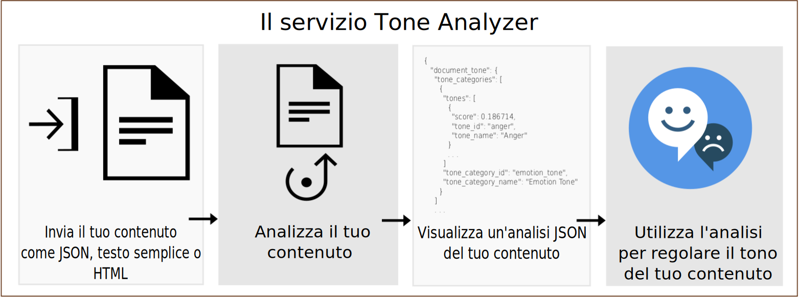

---

copyright:
  years: 2015, 2019
lastupdated: "2019-03-27"

subcollection: tone-analyzer

---

{:shortdesc: .shortdesc}
{:new_window: target="_blank"}
{:tip: .tip}
{:important: .important}
{:note: .note}
{:deprecated: .deprecated}
{:pre: .pre}
{:codeblock: .codeblock}
{:screen: .screen}
{:javascript: .ph data-hd-programlang='javascript'}
{:java: .ph data-hd-programlang='java'}
{:python: .ph data-hd-programlang='python'}
{:swift: .ph data-hd-programlang='swift'}

# Informazioni
{: #about}

> **Aggiornamento del servizio:***il servizio {{site.data.keyword.toneanalyzershort}} è stato aggiornato il 22 febbraio 2019. Il servizio ora utilizza l'autenticazione IAM (Identity and Access Management) basata sui token nell'ubicazione Francoforte di {{site.data.keyword.cloud}} (**eu-de**). Per ulteriori informazioni, vedi l'[aggiornamento del servizio del 22 febbraio 2019](/docs/services/tone-analyzer?topic=tone-analyzer-rnrn#February2019) nelle note sulla release.*

Il servizio {{site.data.keyword.toneanalyzerfull}} utilizza l'analisi linguistica per individuare i toni linguistici ed emotivi nel testo scritto. Il servizio può analizzare il tono ai livelli della frase e del documento. Puoi utilizzare il servizio per capire come le tue comunicazioni scritte vengono percepite e quindi migliorare il tono delle tue comunicazioni. Le aziende possono utilizzare il servizio per avere informazioni sul tono delle comunicazioni dei loro clienti e per rispondere nel modo appropriato a ogni cliente o per comprendere e migliorare le loro conversazioni con i clienti in generale.
{: shortdesc}

Invia input JSON, testo semplice o HTML che contiene il tuo contenuto scritto al servizio. Il servizio accetta fino a 128 KB di testo, che sono circa 1000 frasi. Il servizio restituisci i risultati JSON che riportano il tono del tuo input. Puoi utilizzare questi risultati per migliorare la percezione e l'efficacia delle tue comunicazioni, assicurandoti che la tua scrittura comunichi il tono e lo stile che desideri per i tuoi destinatari previsti. Il seguente diagramma mostra il flusso di base delle chiamate al servizio.

## Endpoint Tone Analyzer
{: #itae}

Il servizio offre due endpoint:

-   **Endpoint di utilizzo generico** (`GET` o `POST /v3/tone`)

    Utilizza l'endpoint di utilizzo generico {{site.data.keyword.toneanalyzershort}} per analizzare i dati web più brevi, come i messaggi email o i tweet o i documenti più lunghi, come un articolo o i post del blog. Monitora i social media per comprendere quali clienti stanno parlando del marchio e per determinare a chi destinare la messaggistica specifica. L'endpoint accetta input JSON, testo semplice o HTML. Per ulteriori informazioni sul metodo e sui toni che restituisce, consulta [Utilizzo dell'endpoint di utilizzo generico](/docs/services/tone-analyzer?topic=tone-analyzer-utgpe).

    La [demo di utilizzo generico ](https://tone-analyzer-demo.ng.bluemix.net/){: new_window} invia il contenuto al servizio per l'analisi. Il servizio restituisce le analisi al livello della frase del tono del contenuto.
-   **Endpoint di coinvolgimento del cliente** (`POST /v3/tone_chat`)

    Utilizza l'endpoint di coinvolgimento del cliente {{site.data.keyword.toneanalyzershort}} per monitorare le conversazioni del supporto e del servizio clienti. Inoltra le conversazioni del cliente quando peggiorano o trovi l'opportunità di migliorare gli script del servizio clienti, le strategie di dialogo e i percorsi del cliente. L'endpoint accetta l'input JSON. Per ulteriori informazioni sul metodo e sui toni che restituisce, consulta [Utilizzo dell'endpoint di coinvolgimento del cliente](/docs/services/tone-analyzer?topic=tone-analyzer-utco).

    La [demo di coinvolgimento del cliente ](https://customer-engagement-demo.ng.bluemix.net/){: new_window} analizza le conversazioni tra i clienti e gli agenti del servizio clienti. Il servizio misura le preoccupazioni e la soddisfazione del cliente e valuta le prestazioni dell'agente in modo che tu possa valutare come si evolve l'interazione.

Per ulteriori informazioni sui piani di prezzi disponibili per il servizio, vedi il servizio {{site.data.keyword.toneanalyzershort}} nel [catalogo {{site.data.keyword.cloud_notm}} ](https://{DomainName}/catalog/services/tone-analyzer){: new_window}.

## Casi di utilizzo
{: #iuc}

Alcuni interessanti casi di utilizzo del servizio sono

-   *Ascolto nei social e monitoraggio dei destinatari*: monitora i social media per comprendere quali clienti stanno parlando del tuo marchio in tempo reale. Ad esempio, potresti determinare che i tuoi clienti in Chicago sono tristi dopo che i Bulls hanno perso o felici durante il festival Taste of Chicago. (Endpoint di utilizzo generico)
-   *Marketing personalizzato*; determina a chi destinare la messaggistica personalizzata e quando. Ad esempio, una compagnia di viaggi potrebbe inviare a clienti felici la messaggistica "regalati", a clienti tristi "scappa" e a clienti arrabbiati "relax". (Endpoint di utilizzo generico)
-   *Chat bot*: abilita un agent automatizzato per rilevare i toni del cliente e per creare risposte adeguate. Ad esempio, potresti rispondere alla tristezza con "Mi dispiace che sei turbato da questo problema" o alla soddisfazione con "Sono lieto che sei soddisfatto dei nostri servizi." (Endpoint di coinvolgimento del cliente)
-   *Monitoraggio del coinvolgimento del cliente e del controllo qualità*: monitora il tono generale delle comunicazioni del cliente e dell'agente, rileva le anomalie ed evidenzia le opportunità di formare gli agenti su come comunicare in modo migliore. (Endpoint di coinvolgimento del cliente)

Puoi anche utilizzare il servizio {{site.data.keyword.toneanalyzershort}} per analizzare l'input dell'utente con altri servizi {{site.data.keyword.ibmwatson}} quali [{{site.data.keyword.conversationfull}}](https://{DomainName}/docs/services/conversation/index.html) o [{{site.data.keyword.speechtotextfull}}](https://{DomainName}/docs/services/speech-to-text/index.html). Ad esempio, l'applicazione [Conversation Food Coach ](https://food-coach.ng.bluemix.net/){: new_window} utilizza il servizio {{site.data.keyword.conversationshort}} per insegnare agli utenti a fare scelte sul cibo in base alle loro risposte su quello che mangiano. Per ulteriori informazioni, vedi questo [post del blog {{site.data.keyword.watson}} ](https://developer.ibm.com/watson/blog/2016/10/17/creating-a-compassionate-conversational-agent-using-watson-tone-analyzer-and-watson-conversation-services/){: new_window}.

Il servizio {{site.data.keyword.toneanalyzershort}} calcola algoritmicamente il tono del testo scritto. Non deduce le caratteristiche della personalità dell'autore del testo. Per ottenere un ritratto sulla personalità, consulta il servizio [{{site.data.keyword.personalityinsightsfull}} ](https://{DomainName}/docs/services/personality-insights/index.html){: new_window}.
{: note}

## Supporto lingua
{: #languages}

I metodi `/v3/tone` e `/v3/tone_chat` possono analizzare il contenuto in inglese (`en`) e in francese (`fr`). Entrambi i metodi possono rispondere con contenuto localizzato in varie lingue. Per ulteriori informazioni, consulta [Utilizzo dell'endpoint di utilizzo generico](/docs/services/tone-analyzer?topic=tone-analyzer-utgpe) e [Utilizzo dell'endpoint di coinvolgimento del cliente](/docs/services/tone-analyzer?topic=tone-analyzer-utco).

## HIPAA
{: #hipaa}

Il supporto dell'HIPAA (Health Insurance Portability and Accountability Act) degli Stati Uniti non si applica al servizio {{site.data.keyword.toneanalyzershort}} Il servizio è senza stato. Non memorizza dati utente su {{site.data.keyword.cloud_notm}}.
