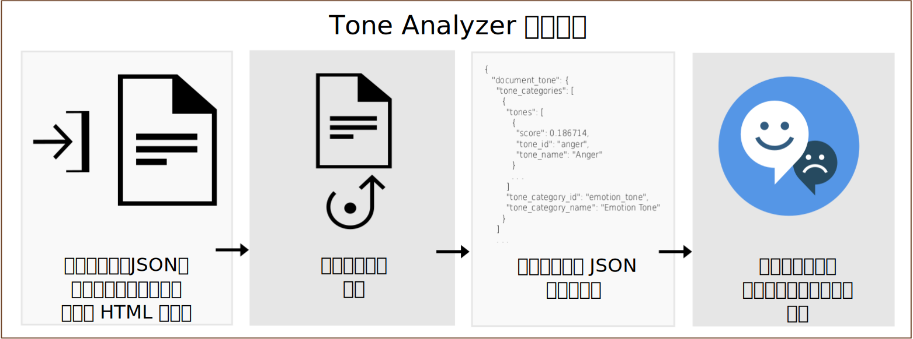

---

copyright:
  years: 2015, 2019
lastupdated: "2019-03-27"

subcollection: tone-analyzer

---

{:shortdesc: .shortdesc}
{:new_window: target="_blank"}
{:tip: .tip}
{:important: .important}
{:note: .note}
{:deprecated: .deprecated}
{:pre: .pre}
{:codeblock: .codeblock}
{:screen: .screen}
{:javascript: .ph data-hd-programlang='javascript'}
{:java: .ph data-hd-programlang='java'}
{:python: .ph data-hd-programlang='python'}
{:swift: .ph data-hd-programlang='swift'}

# 製品情報
{: #about}

> **サービスの更新:** *{{site.data.keyword.toneanalyzershort}} サービスは、2019 年 2 月 22 日に更新されました。 サービスが、トークン・ベースの ID およびアクセス管理 (IAM) 認証を {{site.data.keyword.cloud}} フランクフルト・ロケーション (**eu-de**) でサポートするようになりました。詳しくは、リリース・ノートの 「[2019 年 2 月 22 日のサービスの更新](/docs/services/tone-analyzer?topic=tone-analyzer-rnrn#February2019)」を参照してください。*

{{site.data.keyword.toneanalyzerfull}} サービスは、言語分析を使用して、記述されたテキストから感情トーンと言語トーンを検出します。 このサービスは、ドキュメントとセンテンスの両方のレベルでトーンを分析できます。 このサービスを使用して、コミュニケーションのために記述した内容がどのように受け取られるかを理解し、記述内容のトーンを改善することができます。 企業はこのサービスを使用して、お客様の記述内容のトーンを理解し、お客様に応じて適切に対応することができます。また、お客様との会話全般を理解して改善することができます。
{: shortdesc}

記述されたコンテンツを含む JSON、プレーン・テキスト、または HTML の入力をサービスに送信します。 サービスは最大 128 KB のテキスト (約 1000 センテンス) を受け入れます。 サービスは、入力のトーンを報告する JSON 結果を返します。 それらの結果を使用して、コミュニケーションの受け取られ方と効果を改善し、意図するトーンとスタイルが対象者に伝わる記述にすることができます。 以下の図は、サービスに対する基本的な呼び出しのフローを示しています。

## Tone Analyzer のエンドポイント
{: #itae}

サービスには、以下の 2 つのエンドポイントが用意されています。

-   **汎用エンドポイント** (`GET` または `POST /v3/tone`)

    {{site.data.keyword.toneanalyzershort}} 汎用エンドポイントは、E メール・メッセージやツイートなどの短い Web データ、また、記事やブログ投稿などの長いドキュメントを分析するために使用します。 ソーシャル・メディアをモニターして、あるブランドについてのお客様達の発言を理解し、特定のメッセージを送るターゲットを決定できます。 このエンドポイントは、JSON、プレーン・テキスト、または HTML の入力を取ります。 メソッドと返されるトーンについて詳しくは、[汎用エンドポイントの使用](/docs/services/tone-analyzer?topic=tone-analyzer-utgpe)を参照してください。

    [汎用のデモ ](https://tone-analyzer-demo.ng.bluemix.net/){: new_window} で、コンテンツを分析のためにサービスに送信できるようになりました。サービスは、そのコンテンツについて全体的に分析したトーンとセンテンス・レベルで分析したトーンを返します。
-   **カスタマー・エンゲージメント・エンドポイント** (`POST /v3/tone_chat`)

    {{site.data.keyword.toneanalyzershort}} カスタマー・エンゲージメント・エンドポイントは、カスタマー・サービスとサポートの会話をモニターするために使用します。 お客様の機嫌が悪くなったときにお客様との会話をエスカレーションしたり、カスタマー・サービス・スクリプト、ダイアログ戦略、カスタマー・ジャーニーを改善する機会を見つけたりします。 このエンドポイントは JSON 入力を取ります。 メソッドと返されるトーンについて詳しくは、[カスタマー・エンゲージメント・エンドポイントを使用する](/docs/services/tone-analyzer?topic=tone-analyzer-utco)を参照してください。

    [カスタマー・エンゲージメントのデモ ](https://customer-engagement-demo.ng.bluemix.net/){: new_window} では、お客様とカスタマー・サービス担当員の間の会話を分析します。 サービスを使用して、お客様の満足度と不安を測定し、担当員の対応を評価し、対話の展開を正しく読み取れるようにします。

このサービスで提供されている価格プランについて詳しくは、[{{site.data.keyword.cloud_notm}} カタログ ](https://{DomainName}/catalog/services/tone-analyzer){: new_window} の {{site.data.keyword.toneanalyzershort}} サービスを参照してください。

## ユース・ケース
{: #iuc}

このサービスの興味深いユース・ケースをいくつか紹介します。

-   *ソーシャル・リスニングとオーディエンス・モニタリング* - ソーシャル・メディアをモニターして、あるブランドについてのお客様達の発言をリアルタイムで知ることができます。 例えば、シカゴのお客様が、Bulls が試合に負けた後は悲しみ、Taste of Chicago フェスティバルの期間中は喜んでいることがわかる可能性があります (汎用エンドポイント)。
-   *パーソナライズ・マーケティング* - パーソナライズ・メッセージングのターゲットにする人と時期を決定できます。 例えば、旅行会社であれば、満足している消費者には「自分へのご褒美を贈りましょう」というメッセージ、悲しんでいる消費者には「気晴らしをしましょう」というメッセージ、怒っている消費者には「リラックスしましょう」というメッセージを送ることができます (汎用エンドポイント)。
-   *チャットボット* - 自動エージェントがお客様のトーンを検出して適切な応答を生成できるようにします。 例えば、悲しみに対しては「この問題についてはご気分を害してしまい申し訳ありません」、満足に対しては「当社のサービスにご満足いただき、光栄です」と応答することができます (カスタマー・エンゲージメント・エンドポイント)。
-   *カスタマー・エンゲージメントのモニタリングと品質保証* - 担当員とお客様のコミュニケーションの全体的なトーンをモニターし、異常を検出し、より良くコミュニケーションする方法を担当員に示す好機を強調表示します (カスタマー・エンゲージメント・エンドポイント)。

また、{{site.data.keyword.toneanalyzershort}} サービスを他の {{site.data.keyword.ibmwatson}} サービス ([{{site.data.keyword.conversationfull}}](https://{DomainName}/docs/services/conversation/index.html) や [{{site.data.keyword.speechtotextfull}}](https://{DomainName}/docs/services/speech-to-text/index.html)など) と一緒に使用して、ユーザー入力を分析することもできます。例えば、[Conversation Food Coach ](https://food-coach.ng.bluemix.net/){: new_window} アプリケーションは、{{site.data.keyword.conversationshort}} サービスを使用して、食事内容に関するユーザーの応答を基に健康的な食べ物を選ぶように指導できます。 詳しくは、こちらの [{{site.data.keyword.watson}} ブログ投稿 ](https://developer.ibm.com/watson/blog/2016/10/17/creating-a-compassionate-conversational-agent-using-watson-tone-analyzer-and-watson-conversation-services/){: new_window} を参照してください。

{{site.data.keyword.toneanalyzershort}} サービスは、記述されたテキストのトーンをアルゴリズムを使用して計算します。 テキストの作成者のパーソナリティー特性は推測しません。 パーソナリティーのポートレイトを取得する方法については、[{{site.data.keyword.personalityinsightsfull}} サービス ](https://{DomainName}/docs/services/personality-insights/index.html){: new_window} を参照してください。
{: note}

## 言語サポート
{: #languages}

`/v3/tone` メソッドと `/v3/tone_chat` メソッドは、英語 (`en`) とフランス語 (`fr`) のコンテンツを分析できます。どちらのメソッドも、さまざまな言語でローカライズされたコンテンツを使用して応答できます。 詳しくは、[汎用エンドポイントの使用](/docs/services/tone-analyzer?topic=tone-analyzer-utgpe)と[カスタマー・エンゲージメント・エンドポイントの使用](/docs/services/tone-analyzer?topic=tone-analyzer-utco)を参照してください。

## HIPAA
{: #hipaa}

米国の医療保険の積算と責任に関する法律 (HIPAA) のサポートは、{{site.data.keyword.toneanalyzershort}} サービスには適用されません。サービスはステートレスです。 {{site.data.keyword.cloud_notm}} 上にユーザー・データを保管しません。
