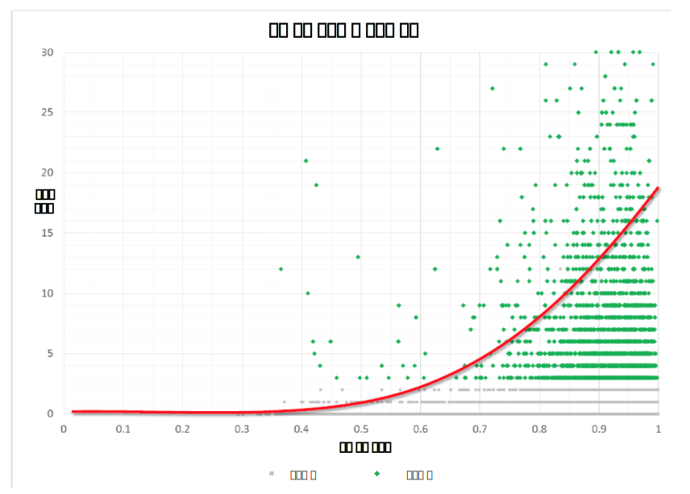

---

copyright:
  years: 2015, 2019
lastupdated: "2019-03-07"

subcollection: tone-analyzer

---

{:shortdesc: .shortdesc}
{:new_window: target="_blank"}
{:tip: .tip}
{:pre: .pre}
{:important: .important}
{:note: .note}
{:deprecated: .deprecated}
{:codeblock: .codeblock}
{:screen: .screen}
{:javascript: .ph data-hd-programlang='javascript'}
{:java: .ph data-hd-programlang='java'}
{:python: .ph data-hd-programlang='python'}
{:swift: .ph data-hd-programlang='swift'}

# 사례 연구
{: #caseStudies}

다음 사례 연구를 읽고 {{site.data.keyword.toneanalyzerfull}} 서비스를 통해 수행할 수 있는 작업에 대해 생각해 보십시오. 이 연구에서는 보고된 어조와 예상 결과 간의 상관 관계에 대해 설명합니다. 상관은 양수이거나 음수일 수 있으며 범위는 -1.0 - 1.0입니다.
{: shortdesc}

## 지원 포럼에서 고객 만족 예측
{: #supportForums}

IBM에서는 여러 산업에 집중하고 있는 소프트웨어 회사의 고객 지원 포럼을 분석했습니다. 이 회사는 적극적으로 고객 지원 포럼을 관리하고 있습니다. 사용자는 유용하다고 판단한 응답에 대해 *칭찬(kudos)*을 줄 수 있습니다.

### 목표
{: #supportForumsGoals}

질문 및 응답의 어조로부터 고객 만족을 예측합니다. IBM은 칭찬을 받은 응답을 사용자가 만족한 것으로 판단했습니다.

### 조치
{: #supportForumsActions}

-   동일한 수의 칭찬을 받은 응답과 그렇지 않은 응답을 포함시키기 위해 여러 개의 포럼에서 1000개의 최신 스레드를 크롤링했습니다.
-   질문과 응답을 모두 분석했습니다.
-   응답이 칭찬을 받을 것인지 예측하기 위해 나이브 베이즈, 서포트 벡터 머신(SVM) 및 랜덤 포레스트와 같은 몇 가지 최상급 분류자를 적용했습니다.

### 결과
{: #supportForumsResults}

서비스는 응답이 칭찬을 받을 것인지를 66퍼센트의 정확도로 예측할 수 있었습니다. IBM은 포럼 응답의 어조와 응답이 칭찬을 받는지 여부 사이에 다음과 같은 상관 관계가 있음을 발견했습니다. 

-   응답이 더 자신 있을수록 칭찬을 받을 가능성이 높습니다(자신 있음에 대한 높은 점수와 칭찬 간에 0.23의 상관이 있음).
-   응답이 더 자신 없을수록 칭찬을 받을 가능성이 낮습니다(자신 없음에 대한 높은 점수와 칭찬 간에 -0.27의 음수 상관이 있음).

## Twitter 응답의 고객 만족 예측
{: #twitterResponses}

많은 회사는 고객 지원을 Twitter에서 제공하도록 전환하고 있습니다. Twitter는 실시간 응답을 가능하게 하며, 이는 고객을 진정으로 생각한다는 브랜드 이미지를 구축하는 데 도움을 줍니다.

IBM은 Twitter에서 이뤄진 333개의 고객 지원 대화를 분석했습니다. 고객은 이러한 대화 중 240개에 대해 만족했으며 93개에 대해서는 만족하지 않았습니다. IBM은 대화를 읽고 여기에 레이블을 지정하여 만족 여부를 판단했습니다. 응답이 문제점을 해결하고 고객이 만족스러워 보인 경우에는 응답에 "고객 만족"이라는 레이블이 지정되었습니다. 그리고 해당 응답으로 고객이 만족할 수 있도록 문제점이 처리되지 않은 경우에는 응답에 "고객 불만족"이라는 레이블이 지정되었습니다. 

### 목표
{: #twitterResponsesGoals}

직원과 고객 간 대화의 어조가 전체 고객 만족에 영향을 주는지 검증합니다. 고객 만족에 중대한 영향을 주는 어조 특성 또한 식별합니다. 

### 조치
{: #twitterResponsesActions}

-   트윗에서 구두점, 멘션 및 링크를 제거했습니다.
-   각 상호작용을 고객 트윗과 지원 트윗으로 분할했습니다.
-   각 측의 대화를 {{site.data.keyword.toneanalyzershort}} 서비스로 분석하고 상관을 찾기 위해 결과를 분석했습니다.

### 결과
{: #twitterResponsesResults}

서비스는 응답의 어조로부터 67퍼센트의 정확도로 고객 만족을 예측할 수 있었습니다. IBM은 고객 트윗의 어조와 고객이 응답에 만족하는지 여부 사이에 다음과 같은 상관 관계가 있음을 발견했습니다.

-   고객이 화가 날수록 응답에 만족할 가능성이 낮습니다. 고객 트윗의 분노에 대한 높은 점수와 고객 만족 간에는 -0.198의 음수 상관이 있습니다. 

## TED 강연 박수 예측
{: #tedTalks}

TED는 "알릴 가치가 있는 아이디어"라는 슬로건을 걸고 세계적인 컨퍼런스를 개최하는 비영리 조직입니다. TED 강연 발표자는 18분 동안 혁신적이며 매력적인 스토리텔링을 사용하여 연구, 과학 및 문화와 관련된 다양한 주제를 다룹니다. 모든 TED 강연이 인기가 있는 것은 아니며, 강연에 대한 관중의 만족도를 측정하는 한 가지 방법은 강연이 받는 박수를 측정하는 것입니다.

### 목표
{: #tedTalksGoals}

TED 강연의 어떤 어조 패턴이 박수로 이어지고 어떤 패턴은 그렇지 않은지 발견합니다. 또한 문장의 어조를 기준으로 박수를 예측합니다. 

### 조치
{: #tedTalksActions}

박수를 받은 문장은 데이터 세트에 이미 태그가 지정되어 있습니다.

-   1931개의 TED 강연을 검토했습니다.
-   "박수"로 태그가 지정된 문장을 "박수를 받은 텍스트"로 분류했습니다. 또한 "박수를 받은 텍스트" 앞의 세 문장과 뒤의 세 문장을 "박수를 받지 않은 텍스트"로 태그를 지정했습니다.
-   받수를 받은 텍스트와 받지 않은 텍스트를 모두 {{site.data.keyword.toneanalyzershort}} 서비스로 분석했습니다.
-   발견된 상관을 기반으로, 어조에 따라 다른 TED 강연의 박수를 예측하는 분류자를 작성했습니다.

### 결과
{: #tedTalksResults}

서비스에서는 박수를 받을 것인지 75퍼센트의 정확도로 예측할 수 있었습니다. IBM은 각 문장 세트의 어조와 이러한 문장이 박수를 받을 것인지 사이에 다음과 같은 상관 관계가 있음을 발견했습니다.

-   발표자가 슬픔을 표현할수록 박수를 받을 가능성이 낮습니다(슬픔에 대한 높은 점수와 박수 간에 -0.055의 음수 상관이 있음).
-   발표자가 감정을 드러내지 않거나 냉담해 보일수록 박수를 받을 가능성이 낮습니다(분석적에 대한 높은 점수와 박수 간에 -0.29의 음수 상관이 있음).
-   발표자가 즐겁거나 만족스러워 보일수록 박수를 받을 가능성이 높습니다(기쁨에 대한 높은 점수와 박수 간에 0.21의 상관이 있음).

## Twitter 리트윗 및 좋아요 예측
{: #twitterRetweets}

Twitter에서 브랜드를 확립하는 것이 회사의 성공을 위한 요구사항이 되고 있습니다. 사용자 또는 회사의 계정을 팔로우할 만한 가치가 있는 것으로 구축하는 데 있어서 필수적인 부분은 좋아요 및 리트윗을 많이 받는 트윗을 작성하는 것입니다.

### 목표
{: #twitterRetweetsGoals}

트윗의 어조와 트윗이 좋아요를 받거나 리트윗되는지 사이에 상관 관계를 찾습니다.

### 조치
{: #twitterRetweetsActions}

-   Twitter의 여러 비즈니스 계정에서 5881개의 트윗을 크롤링했습니다.
-   트윗에서 구두점, 멘션 및 링크를 제거했습니다.
-   각 트윗을 {{site.data.keyword.toneanalyzershort}} 서비스로 분석하고 상관을 찾기 위해 결과를 분석했습니다.

### 결과
{: #twitterRetweetsResults}

IBM은 트윗의 어조와 트윗이 좋아요를 받거나 리트윗되는지 사이에 상관 관계를 발견했습니다.

## 온라인 데이트 상대 예측
{: #onlineDating}

전 세계의 많은 사람들이 특별한 누군가를 만나기 위해 온라인 데이트를 사용하고 있습니다. 사람들은 자신과 공통점이 많은 사람을 찾고 자신을 잠재적 상대로 홍보하기 위해 온라인 데이트를 사용합니다.

### 목표
{: #onlineDatingGoals}

개인 프로파일의 어조와 잠재적 상대의 프로파일 어조 간에 상관을 식별합니다. 이러한 상관이 커플이 될 가능성을 예측할 수 있는지도 알아봅니다. 

### 조치
{: #onlineDatingActions}

-   약 50,000개의 사용자 프로파일을 크롤링했습니다.
-   각 프로파일을 {{site.data.keyword.toneanalyzershort}} 서비스로 분석했습니다.
-   사이트를 통해 서로 이야기를 나눈 사람들을 잠재적 상대로 정의했습니다. 
-   상관을 찾기 위해 잠재적 상대의 어조 분석을 비교했습니다.
-   두 사용자가 서로 이야기를 나눌 것인지 예측하기 위해 프로파일의 어조 유사성으로부터 통계 모델을 개발했습니다. 그 후 이 모델을 인구 통계와 같은 기타 속성을 고려하는 여러 기준선과 비교했습니다. 

### 결과
{: #onlineDatingResults}

프로파일 간의 어조 유사성은 두 사용자가 이야기를 나눌 것인지를 데이트 웹 사이트에서 일반적으로 사용하는 예측 프로그램보다 45퍼센트 향상되었습니다. IBM은 다음 이미지에 표시되어 있는 바와 같이 교환된 메시지 수와 어조 유사성 간에 전반적으로 깊은 상관 관계가 있음을 발견했습니다. 

