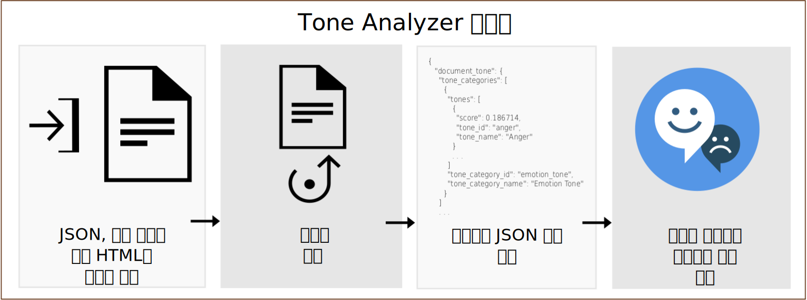

---

copyright:
  years: 2015, 2019
lastupdated: "2019-03-27"

subcollection: tone-analyzer

---

{:shortdesc: .shortdesc}
{:new_window: target="_blank"}
{:tip: .tip}
{:important: .important}
{:note: .note}
{:deprecated: .deprecated}
{:pre: .pre}
{:codeblock: .codeblock}
{:screen: .screen}
{:javascript: .ph data-hd-programlang='javascript'}
{:java: .ph data-hd-programlang='java'}
{:python: .ph data-hd-programlang='python'}
{:swift: .ph data-hd-programlang='swift'}

# 정보
{: #about}

> **서비스 업데이트:** *{{site.data.keyword.toneanalyzershort}} 서비스는 2019년 2월 22일에 업데이트되었습니다. 서비스는 이제 {{site.data.keyword.cloud}} 프랑크프루트 위치(**eu-de**)에서 토큰 기반 IAM(Identity and Access Management) 인증을 사용합니다. 자세한 정보는 릴리스 정보의 [2019년 2월 22일 서비스 업데이트](/docs/services/tone-analyzer?topic=tone-analyzer-rnrn#February2019)를 참조하십시오.*

{{site.data.keyword.toneanalyzerfull}} 서비스는 언어학적 분석을 통해 기록된 텍스트의 감정적 및 언어적 톤을 감지합니다. 이 서비스는 문서 및 문장 레벨에서 어조를 분석할 수 있습니다. 사용자는 이 서비스를 사용하여 기록된 의사소통의 내용이 어떻게 인식되는지 이해하고 의사소통의 어조를 개선할 수 있습니다. 기업은 이 서비스를 사용하여 각 고객의 의사소통에 나타난 어조를 이해하고 적절히 응대하거나, 고객과의 의사소통 전반을 이해하고 개선할 수 있습니다.
{: shortdesc}

사용자는 기록된 컨텐츠를 포함하는 JSON, 일반 텍스트 또는 HTML 입력을 서비스에 제출합니다. 서비스는 최대 128KB의 텍스트(약 1000개 문장)를 수락합니다. 서비스는 입력의 어조를 보고하는 JSON 결과를 리턴합니다. 사용자는 이러한 결과를 사용하여, 자신의 글이 의도한 대상에게 원하는 어조 및 스타일을 전달하도록 함으로써 의사소통의 인식 및 유효성을 개선할 수 있습니다. 다음 다이어그램은 서비스에 대한 호출의 기본 플로우를 보여줍니다.

## Tone Analyzer 엔드포인트
{: #itae}

이 서비스는 두 가지 엔드포인트를 제공합니다.

-   **범용 엔드포인트**(`GET` 또는 `POST /v3/tone`)

    짧은 웹 데이터(이메일 메시지 또는 트윗) 또는 긴 문서(기사 또는 블로그 게시물)를 분석하려면 {{site.data.keyword.toneanalyzershort}} 범용 엔드포인트를 사용하십시오. 소셜 미디어를 모니터링하여 고객이 브랜드에 대해 어떤 이야기를 하는지 이해하고 특정 메시지를 보낼 대상을 결정하십시오. 이 엔드포인트는 JSON, 일반 텍스트 또는 HTML 입력을 수락합니다. 메소드와 이 엔드포인트가 리턴하는 어조에 대한 자세한 정보는 [범용 엔드포인트 사용](/docs/services/tone-analyzer?topic=tone-analyzer-utgpe)을 참조하십시오. 

    [범용 데모 ](https://tone-analyzer-demo.ng.bluemix.net/){: new_window}에서는 사용자가 분석을 위해 서비스에 컨텐츠를 제출합니다. 서비스는 컨텐츠의 어조에 대한 전체 및 문장 레벨 분석을 리턴합니다.
-   **고객 참여 엔드포인트**(`POST /v3/tone_chat`)

    고객 서비스 및 지원 대화를 모니터링하려면 {{site.data.keyword.toneanalyzershort}} 고객 참여 엔드포인트를 사용하십시오. 고객과의 대화가 바람직하지 않은 방향으로 흘러가는 경우에는 이를 에스컬레이션하거나 고객 서비스 스크립트, 대화 전략 및 고객 여정을 개선할 기회를 찾아보십시오. 이 엔드포인트는 JSON 입력을 수락합니다. 메소드와 이 엔드포인트가 리턴하는 어조에 대한 자세한 정보는 [고객 참여 엔드포인트 사용](/docs/services/tone-analyzer?topic=tone-analyzer-utco)을 참조하십시오. 

    [고객 참여 데모 ](https://customer-engagement-demo.ng.bluemix.net/){: new_window}에서는 고객과 고객 서비스 직원 간의 대화를 분석합니다. 서비스는 상호작용이 어떻게 변화했는지 사용자가 판단할 수 있도록 고객의 문제 및 만족 여부를 측정하고, 직원 성과를 평가합니다. 

서비스에 대해 사용 가능한 가격 플랜에 대한 자세한 정보는 [{{site.data.keyword.cloud_notm}} 카탈로그 ](https://{DomainName}/catalog/services/tone-analyzer){: new_window}의 {{site.data.keyword.toneanalyzershort}} 서비스를 참조하십시오. 

## 유스 케이스
{: #iuc}

서비스의 몇 가지 유스 케이스는 다음과 같습니다. 

-   *소셜 미디어 청취 및 대중 모니터링* - 소셜 미디어를 모니터링하여 고객이 사용자의 브랜드에 대해 실시간으로 어떤 이야기를 하고 있는지 알아보십시오. 예를 들면, 시카고에 사는 고객들이 Bulls 팀이 시합에 져서 슬퍼한다거나 Taste of Chicago 축제 때문에 기뻐하고 있음을 파악할 수 있습니다. (범용 엔드포인트)
-   *맞춤형 마케팅* - 맞춤형 메시지를 보낼 대상 및 시점을 결정하십시오. 예를 들면, 여행 회사는 기뻐하는 고객에게는 "자신에게 상을 주라"는 메시지를, 슬퍼하는 고객에게는 "떠나라"는 메시지를, 화가 난 고객에게는 "편히 쉬라"는 메시지를 보낼 수 있습니다. (범용 엔드포인트)
-   *대화 봇* - 자동화된 직원 봇이 고객의 어조를 감지하고 적절한 응답을 작성하도록 설정할 수 있습니다. 예를 들면, 슬픈 어조에는 "이 문제로 심려를 끼쳐드려 죄송합니다", 만족하는 어조에는 "서비스에 만족하셨다니 기쁩니다"와 같이 응답할 수 있습니다. (고객 참여 엔드포인트)
-   *고객 참여 모니터링 및 품질 보증* - 직원 및 고객 의사소통의 전체 어조를 모니터링하고, 이상 항목을 발견하고, 의사소통 능력을 향상시킬 방법에 대해 직원을 훈련시킬 기회를 발견하십시오. (고객 참여 엔드포인트)

{{site.data.keyword.toneanalyzershort}} 서비스를 {{site.data.keyword.ibmwatson}} 서비스(예: [{{site.data.keyword.conversationfull}}](https://{DomainName}/docs/services/conversation/index.html) 또는 [{{site.data.keyword.speechtotextfull}}](https://{DomainName}/docs/services/speech-to-text/index.html))와 함께 사용하여 사용자 입력을 분석할 수도 있습니다. 예를 들면, [Conversation Food Coach ](https://food-coach.ng.bluemix.net/){: new_window} 애플리케이션은 {{site.data.keyword.conversationshort}} 서비스를 사용하여 사용자가 자신이 먹는 음식에 대해 응답한 내용에 따라 건강에 도움이 되는 음식을 선택할 수 있도록 안내합니다. 자세한 정보는 이 [{{site.data.keyword.watson}} 블로그 게시물 ](https://developer.ibm.com/watson/blog/2016/10/17/creating-a-compassionate-conversational-agent-using-watson-tone-analyzer-and-watson-conversation-services/){: new_window}을 참조하십시오. 

{{site.data.keyword.toneanalyzershort}} 서비스는 기록된 텍스트의 어조를 알고리즘을 통해 계산합니다. 이 서비스는 텍스트 작성자의 성격 특성을 추측하지 않습니다. 성격 묘사를 얻으려면 [{{site.data.keyword.personalityinsightsfull}} 서비스 ](https://{DomainName}/docs/services/personality-insights/index.html){: new_window}를 참조하십시오.
{: note}

## 언어 지원
{: #languages}

`/v3/tone` 및 `/v3/tone_chat` 메소드는 영어(`en`) 및 프랑스어(`fr`)로 된 컨텐츠를 분석할 수 있습니다. 두 메소드는 모두 다양한 언어로 현지화된 컨텐츠로 응답할 수 있습니다. 자세한 정보는 [범용 엔드포인트 사용](/docs/services/tone-analyzer?topic=tone-analyzer-utgpe) 및 [고객 참여 엔드포인트 사용](/docs/services/tone-analyzer?topic=tone-analyzer-utco)을 참조하십시오. 

## HIPAA
{: #hipaa}

미국 의료 정보 보호법(HIPAA) 지원은 {{site.data.keyword.toneanalyzershort}} 서비스에 적용되지 않습니다. 서비스는 Stateless입니다. {{site.data.keyword.cloud_notm}}에 사용자 데이터를 저장하지 않습니다. 
