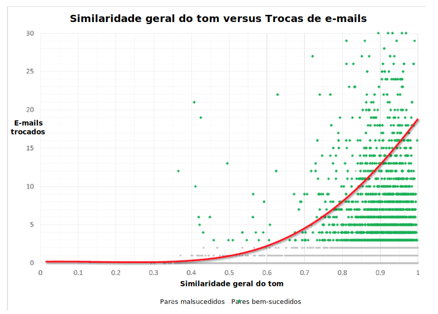

---

copyright:
  years: 2015, 2019
lastupdated: "2019-03-07"

subcollection: tone-analyzer

---

{:shortdesc: .shortdesc}
{:new_window: target="_blank"}
{:tip: .tip}
{:pre: .pre}
{:important: .important}
{:note: .note}
{:deprecated: .deprecated}
{:codeblock: .codeblock}
{:screen: .screen}
{:javascript: .ph data-hd-programlang='javascript'}
{:java: .ph data-hd-programlang='java'}
{:python: .ph data-hd-programlang='python'}
{:swift: .ph data-hd-programlang='swift'}

# Estudos de casos
{: #caseStudies}

Leia estes estudos de casos para se inspirar com o que é possível fazer com o serviço do {{site.data.keyword.toneanalyzerfull}}. Os estudos descrevem a correlação entre tons relatados e resultados esperados. A correlação pode ser positiva ou negativa e tem um intervalo de -1,0 a 1,0.
{: shortdesc}

## Prevendo a satisfação do cliente em fóruns de suporte
{: #supportForums}

A IBM analisou fóruns de suporte ao cliente em uma empresa de software que tem como foco diversas indústrias. A empresa contribui ativamente para fóruns de suporte ao cliente. Os usuários podem fornecer *Congratulações* para respostas que acharem úteis.

### Objetivos
{: #supportForumsGoals}

Prever satisfação do cliente com base no tom da pergunta e da resposta. A IBM considerou que uma resposta com Congratulações significa que o usuário estava satisfeito.

### Ações
{: #supportForumsActions}

-   Foi feito crawl dos 1000 encadeamentos mais recentes de diversos fóruns, assegurando que fosse incluído o mesmo número de respostas com e sem Congratulações.
-   Tanto as perguntas quanto as respostas foram analisadas.
-   Vários classificadores de última geração foram aplicados, como Naive Bayes, Support Vector Machine (SVM) e Random Forest, para prever se uma resposta receberia Congratulações.

### Resultados
{: #supportForumsResults}

O serviço pode prever Congratulações com precisão de 66%. A IBM descobriu as seguintes correlações entre os tons de uma resposta do fórum e se essa resposta recebe Avaliações positivas:

-   Quanto mais confiante for uma resposta, mais provavelmente receberá Congratulações (correlação de 0,23 entre uma pontuação de valor alto para confiança e Congratulações).
-   Quanto mais hesitante for uma resposta, menos provavelmente receberá Congratulações (correlação negativa de -0,27 entre uma pontuação de valor alto para hesitante e Congratulações).

## Prevendo a satisfação do cliente em respostas no Twitter
{: #twitterResponses}

Muitas empresas estão migrando o suporte ao cliente para o Twitter. O Twitter permite respostas em tempo real, o que ajuda a estabelecer a marca como uma com pessoas reais que se importa com seus clientes.

A IBM analisou 333 conversas de suporte ao cliente no Twitter. Os clientes ficaram satisfeitos em 240 das conversas e insatisfeitos com 93 das interações. A IBM mediu a satisfação lendo as conversas e rotulando-as. As
respostas foram rotuladas como "cliente satisfeito" quando resolviam o problema e o cliente parecia satisfeito. Elas foram rotuladas como "cliente não satisfeito" quando o problema não foi resolvido para a satisfação do cliente.

### Objetivos
{: #twitterResponsesGoals}

Validar se o tom da conversa entre o agente e o cliente afetou a satisfação geral do cliente. Além disso, identificar os recursos de tom que afetam significativamente a satisfação do cliente.

### Ações
{: #twitterResponsesActions}

-   Pontuações, menções e links foram removidos dos tweets.
-   Cada interação foi dividida entre tweets do cliente e tweets do suporte.
-   Cada lado da conversa foi analisado com o serviço do {{site.data.keyword.toneanalyzershort}} e os resultados foram comparados para encontrar correlações.

### Resultados
{: #twitterResponsesResults}

O serviço pode prever a satisfação do cliente com base no tom da resposta com precisão de 67%. A IBM descobriu a correlação a seguir entre o tom de tweets do cliente e se o cliente estava satisfeito com a resposta:

-   Quanto mais irritados os clientes estiverem, menor a probabilidade de eles ficarem satisfeitos com a resposta. Existe
uma correlação negativa de -0,198 entre uma pontuação de alto valor na categoria raiva em um tweet do cliente e a
satisfação do cliente.

## Prevendo aplausos para TED Talks
{: #tedTalks}

TED é uma organização sem fins lucrativos que promove conferências globais com o slogan "Ideias que valem a pena divulgar". Palestrantes de TED Talks têm 18 minutos para usar técnicas inovadoras e envolventes para contar histórias para abordar uma ampla gama de tópicos dentro da pesquisa e da prática científica e cultural. Nem todos os TED Talks são populares e uma maneira para medir a satisfação do público com um talk é medir os aplausos que recebe.

### Objetivos
{: #tedTalksGoals}

Descobrir quais padrões de tons em TED Talks levam a aplausos e quais padrões não. Além disso, prever aplausos com base no tom de uma sentença.

### Ações
{: #tedTalksActions}

Sentenças que receberam aplausos já foram identificadas no conjunto de dados.

-   1931 TED Talks foram revisados.
-   Uma sentença identificada com "Aplausos" foi categorizada como "texto de aplauso". As três sentenças anteriores à sentença também foram identificadas como "texto de aplausos" e as três sentenças posteriores a ela como "texto sem aplausos".
-   Os textos de aplausos e sem aplausos foram analisados com o serviço do {{site.data.keyword.toneanalyzershort}}.
-   Com base nas correlações encontradas, classificadores foram criados para prever aplausos em outros TED Talks com base em seu tom.

### Resultados
{: #tedTalksResults}

O serviço pode prever aplausos com precisão de 75%. A IBM encontrou as correlações a seguir entre o tom de cada conjunto de sentenças e se essas sentenças receberam aplausos:

-   Quanto mais tristeza um palestrante expressar, menos provavelmente receberá aplausos (correlação negativa de -0,055 entre uma pontuação de valor alto para tristeza e aplausos).
-   Quanto menos emotivo ou mais impessoal o palestrante parecer, menos provavelmente receberá aplausos (correlação negativa de -0,29 entre uma pontuação de valor alto para analítico e aplausos).
-   Quanto mais alegre, contente e satisfeito um palestrante parecer, mais provavelmente receberá aplausos (correlação de 0,21 entre uma pontuação de valor alto para alegria e aplausos).

## Prevendo retweets e curtidas no Twitter
{: #twitterRetweets}

Estabelecer uma marca no Twitter está se tornando um requisito para o sucesso das empresas. Um ponto essencial para estabelecer que vale a pena seguir você ou sua empresa é criar tweets que reúnam muitas curtidas e retweets.

### Objetivos
{: #twitterRetweetsGoals}

Encontrar correlações entre o tom de um tweet e se esse tweet foi curtido ou retweetado.

### Ações
{: #twitterRetweetsActions}

-   Foi feito crawl de 5881 tweets de várias contas de negócios no Twitter.
-   Pontuações, menções e links foram removidos dos tweets.
-   Cada tweet foi analisado com o serviço do {{site.data.keyword.toneanalyzershort}} e os resultados foram comparados para encontrar correlações.

### Resultados
{: #twitterRetweetsResults}

A IBM encontrou correlações entre o tom de um tweet e se ele foi curtido e entre o tom de um tweet e se ele foi retweetado.

## Prevendo pares para encontros on-line
{: #onlineDating}

Milhões de pessoas ao redor do mundo usam encontros on-line para conhecerem aquele alguém especial. As pessoas usam encontros on-line para identificarem outras que têm muito em comum com elas e para se apresentarem como parceiros em potencial.

### Objetivos
{: #onlineDatingGoals}

Correlacionar o tom do perfil de um indivíduo com o tom do perfil de um par em potencial. Além disso, descobrir se essa correlação prevê o sucesso da correspondência.

### Ações
{: #onlineDatingActions}

-   Foi feito crawl de aproximadamente 50.000 perfis de usuário.
-   Cada perfil foi analisado com o serviço do {{site.data.keyword.toneanalyzershort}}.
-   O potencial definido corresponde aos usuários que se comunicaram por meio do site.
-   A análise de tom dos pares em potencial foi comparada para encontrar correlações.
-   Foi desenvolvido um modelo estatístico com base na similaridade de tom dos perfis para prever se dois usuários se comunicariam. Em seguida, comparou-se o modelo a várias linhas de base que consideram outros
atributos, tais como dados demográficos.

### Resultados
{: #onlineDatingResults}

A similaridade de tons entre os perfis pode resultar em uma melhoria de 45% na previsão relacionada a se dois usuários vão se comunicar em comparação com os preditores que os sites de namoro usam regularmente. A
IBM descobriu uma forte correlação geral entre a similaridade de tons e o número de mensagens que são
trocadas, conforme mostrado na imagem a seguir.

