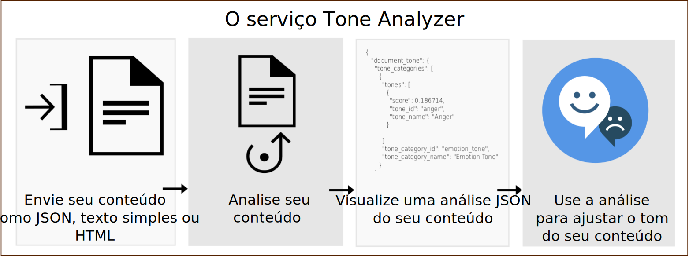

---

copyright:
  years: 2015, 2019
lastupdated: "2019-03-27"

subcollection: tone-analyzer

---

{:shortdesc: .shortdesc}
{:new_window: target="_blank"}
{:tip: .tip}
{:important: .important}
{:note: .note}
{:deprecated: .deprecated}
{:pre: .pre}
{:codeblock: .codeblock}
{:screen: .screen}
{:javascript: .ph data-hd-programlang='javascript'}
{:java: .ph data-hd-programlang='java'}
{:python: .ph data-hd-programlang='python'}
{:swift: .ph data-hd-programlang='swift'}

# Sobre
{: #about}

> **Atualização de serviço:** *o serviço {{site.data.keyword.toneanalyzershort}} foi atualizado em 22 de fevereiro de 2019. O serviço agora usa a autenticação do Identity and Access Management (IAM) baseada em token no local Frankfurt do {{site.data.keyword.cloud}} (**eu-de**). Para obter mais informações, veja a [Atualização
de serviço de 22 de fevereiro de 2019](/docs/services/tone-analyzer?topic=tone-analyzer-rnrn#February2019) nas notas sobre a liberação.

O serviço do {{site.data.keyword.toneanalyzerfull}} usa análise linguística para detectar tons emocionais e de linguagem no texto por escrito. O serviço pode analisar o tom tanto no nível do documento quanto no da sentença. É possível usar o serviço para entender como suas comunicações por escrito são percebidas e, em seguida, melhorar o tom de suas comunicações. As empresas podem usar o serviço para aprender o tom
das comunicações de seus clientes e para responder adequadamente a cada cliente ou para entender e
melhorar as conversas com seus clientes em geral.
{: shortdesc}

Você envia entrada em JSON, texto sem formatação ou HTML que contém seu conteúdo por escrito para o serviço. O serviço aceita até 128 KB de texto, que é cerca de 1000 sentenças. O serviço retorna resultados em JSON que relatam o tom de sua entrada. É possível usar esses resultados para melhorar a percepção e a eficácia de suas comunicações, assegurando que sua composição transmita o tom e o estilo desejados para seu público alvo. O diagrama a seguir mostra o fluxo básico de chamadas para o serviço.

## Terminais do Tone Analyzer
{: #itae}

O serviço oferece dois terminais:

-   **Terminal de uso geral** (`GET` ou `POST /v3/tone`)

    Use o terminal de uso geral do {{site.data.keyword.toneanalyzershort}} para
analisar dados da web mais curtos, tais como mensagens de e-mail, tweets ou documentos mais longos, tais
como artigos ou postagens de blog. Monitore mídia social para entender o que os clientes estão falando sobre uma marca e para determinar a quem direcionar mensagens específicas. O terminal aceita entrada em JSON, texto sem formatação ou HTML. Para obter mais informações
sobre o método e os tons que ele retorna, veja [Usando
o terminal de uso geral](/docs/services/tone-analyzer?topic=tone-analyzer-utgpe).

    A [demo de uso geral ](https://tone-analyzer-demo.ng.bluemix.net/){: new_window} envia conteúdo para o serviço para análise. O serviço retorna análise geral e no nível da sentença sobre o tom do conteúdo.
-   **Terminal de engajamento do cliente** (`POST /v3/tone_chat`)

    Use o terminal de engajamento do cliente do {{site.data.keyword.toneanalyzershort}} para monitorar o atendimento ao cliente e as conversas de suporte. Escale conversas com clientes quando elas derem errado ou encontre oportunidades para melhorar scripts de atendimento ao cliente, estratégias de diálogo e jornadas dos clientes. O terminal aceita entrada em JSON. Para obter mais informações sobre o método e os tons que ele retorna,
veja [Usando o terminal de engajamento
do cliente](/docs/services/tone-analyzer?topic=tone-analyzer-utco).

    A [demo de engajamento do
cliente ](https://customer-engagement-demo.ng.bluemix.net/){: new_window} analisa conversas entre clientes e agentes de atendimento ao cliente. O serviço mede a satisfação e as preocupações do cliente e avalia o desempenho do agente, de
modo que você possa medir como a interação evolui.

Para obter mais informações sobre os planos de precificação disponíveis para o serviço, veja o serviço {{site.data.keyword.toneanalyzershort}} no [{{site.data.keyword.cloud_notm}} Catálogo ](https://{DomainName}/catalog/services/tone-analyzer){: new_window}.

## Casos de uso
{: #iuc}

Alguns casos de uso interessantes do serviço são

-   *Monitoramento de atendimento de rede social e de público* - Monitore a mídia social
para entender o que os clientes estão dizendo sobre sua marca em tempo real. Por exemplo, você pode determinar que seus clientes em Chicago estão tristes após o Bulls ter perdido ou felizes durante o festival Taste of Chicago. (Terminal de uso geral)
-   *Marketing personalizado* - Determine para quem as mensagens personalizadas devem ser direcionadas e quando isso acontecerá. Por exemplo, uma empresa de viagens pode se direcionar a consumidores felizes com mensagens do tipo "presenteie-se", a consumidores tristes com mensagens do tipo "fuja" e a consumidores bravos com mensagens do tipo "relaxe". (Terminal de uso geral)
-   *Robôs de bate-papo* - Ative um agente automatizado para detectar tons do cliente
e criar respostas adequadas. Por exemplo, você pode responder à tristeza com "Sinto muito que você esteja chateado com esse problema" ou à satisfação com "Estou feliz que esteja satisfeito com nosso serviço". (Terminal de engajamento do cliente)
-   *Monitoramento de engajamento do cliente e garantia de qualidade* - Monitore o tom geral das comunicações do agente e do cliente, detecte anomalias e destaque oportunidades para treinar agentes sobre como se comunicar melhor. (Terminal de engajamento do cliente)

Também é possível usar o serviço {{site.data.keyword.toneanalyzershort}} para analisar entradas do usuário com outros serviços {{site.data.keyword.ibmwatson}}, tais como [{{site.data.keyword.conversationfull}}](https://{DomainName}/docs/services/conversation/index.html) ou [{{site.data.keyword.speechtotextfull}}](https://{DomainName}/docs/services/speech-to-text/index.html). Por exemplo, o aplicativo [Conversation Food Coach ](https://food-coach.ng.bluemix.net/){: new_window} usa o serviço {{site.data.keyword.conversationshort}} para treinar os usuários para fazer escolhas alimentares saudáveis com base em suas respostas sobre a comida
que eles comem. Para obter mais informações, veja esta [postagem do blog do {{site.data.keyword.watson}} ](https://developer.ibm.com/watson/blog/2016/10/17/creating-a-compassionate-conversational-agent-using-watson-tone-analyzer-and-watson-conversation-services/){: new_window}.

O serviço {{site.data.keyword.toneanalyzershort}} calcula algoritmicamente o tom do texto escrito. Ele não deduz as características de personalidade do autor do texto. Para obter um retrato de personalidade, veja o serviço [{{site.data.keyword.personalityinsightsfull}} ](https://{DomainName}/docs/services/personality-insights/index.html){: new_window}.
{: note}

## Suporte ao idioma
{: #languages}

Os métodos `/v3/tone` e `/v3/tone_chat` podem analisar conteúdo em inglês (`en`) e francês (`fr`). Os dois métodos podem responder com conteúdo localizado em vários idiomas. Para obter mais informações, veja [Usando o terminal de uso geral](/docs/services/tone-analyzer?topic=tone-analyzer-utgpe) e [Usando o terminal de engajamento do cliente](/docs/services/tone-analyzer?topic=tone-analyzer-utco).

## HIPAA
{: #hipaa}

O suporte do Health Insurance Portability and Accountability Act (HIPAA) dos EUA não se aplica ao
serviço {{site.data.keyword.toneanalyzershort}}. O serviço é stateless. Ele não armazena dados do usuário no {{site.data.keyword.cloud_notm}}.
