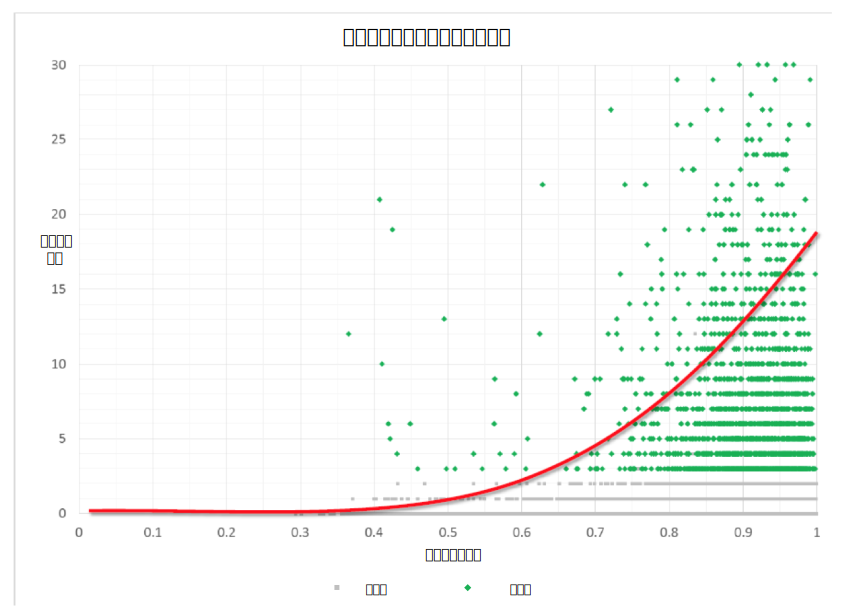

---

copyright:
  years: 2015, 2019
lastupdated: "2019-03-07"

subcollection: tone-analyzer

---

{:shortdesc: .shortdesc}
{:new_window: target="_blank"}
{:tip: .tip}
{:pre: .pre}
{:important: .important}
{:note: .note}
{:deprecated: .deprecated}
{:codeblock: .codeblock}
{:screen: .screen}
{:javascript: .ph data-hd-programlang='javascript'}
{:java: .ph data-hd-programlang='java'}
{:python: .ph data-hd-programlang='python'}
{:swift: .ph data-hd-programlang='swift'}

# 案例研究
{: #caseStudies}

阅读这些案例研究，以获取可以如何利用 {{site.data.keyword.toneanalyzerfull}} 服务的灵感。这些研究描述了报告的语气与预期结果之间的相关性。相关性可以是正数或负数，范围为 -1.0 到 1.0。
{: shortdesc}

## 在支持论坛中预测客户满意度
{: #supportForums}

IBM 分析了一家专注于多个行业的软件公司的客户支持论坛。该公司积极参与客户支持论坛。用户可以为他们认为有用的回答*点赞*。

### 目标
{: #supportForumsGoals}

从问题和响应的语气中预测客户满意度。IBM 假定获得点赞的回答意味着用户满意。

### 操作
{: #supportForumsActions}

-   从多个论坛梳理了最近的 1000 个主题，确保其中获得点赞和未获得点赞的响应数目相同。
-   分析问题和响应。
-   应用多种最先进的分类器（如朴素贝叶斯、支持向量机 (SVM) 和随机林），预测回答是否会获得点赞。

### 结果
{: #supportForumsResults}

该服务可预测点赞的准确率为 66%。IBM 发现论坛响应的语气与该回答是否会获得点赞之间存在以下相关性：

-   响应越确信，就越有可能获得点赞（确信度的高分值与获得点赞之间的相关性为 0.23）。
-   响应越不确定，就越不可能获得点赞（不确定度的高分值与获得点赞之间的负相关性为 -0.27）。

## 在 Twitter 响应中预测客户满意度
{: #twitterResponses}

许多公司正在将客户支持切换到 Twitter。Twitter 允许实时回答，这有助于将品牌形象塑造为真正以客户为本。

IBM 分析了 333 个 Twitter 上的客户支持对话。客户对 240 个对话感到满意，有 93 次互动感到不满意。IBM 通过阅读所有对话并对它们进行标记，测量了满意度。当对话解决了问题并且客户看上去满意时，响应标记为“客户满意”。当客户对问题解决情况不满意时，响应标记为“客户不满意”。

### 目标
{: #twitterResponsesGoals}

验证代理与客户之间的对话语气是否对总体客户满意度产生影响。同时识别显著影响客户满意度的语气特征。

### 操作
{: #twitterResponsesActions}

-   从推文中删除标点、提及和链接。
-   将每个交互拆分为客户推文和支持推文。
-   使用 {{site.data.keyword.toneanalyzershort}} 服务分析对话的每一端，并比较结果以找出相关性。

### 结果
{: #twitterResponsesResults}

该服务能够通过响应的语气来预测客户满意度，准确率为 67%。IBM 发现客户推文的语气与客户对响应是否满意之间存在以下相关性：

-   客户感到越愤怒，他们对响应感到满意的可能性越小。客户推文中愤怒的高分值与客户满意度之间存在 -0.198 的负相关性。

## 预测 TED 演讲掌声
{: #tedTalks}

TED 是一个运营全球会议的非盈利性组织，它的口号是“传播有价值的思想”。TED 演讲嘉宾有 18 分钟的时间，利用新颖独特和引人入胜的故事，来探讨科学和文化研究和实践中所涵盖的广泛主题。并非所有 TED 演讲都受欢迎，一种测量观众对演讲满意度的方法是衡量它所获得的掌声。

### 目标
{: #tedTalksGoals}

探索 TED 演讲中哪些语气模式会获得掌声，哪些语气模式不会获得掌声。同时根据句子的语气来预测掌声。

### 操作
{: #tedTalksActions}

收到掌声的句子已在数据集中进行了标记。

-   回顾 1931 年的 TED 演讲。
-   将标有“Applause”的句子分类为“applause text”。此外，将标有“applause text”句子的前三句和后三句标记为“non-applause text”。
-   使用 {{site.data.keyword.toneanalyzershort}} 服务对掌声和非掌声文本进行分析。
-   基于所发现的相关性，创建分类器以根据其语气在其他 TED 演讲中预测掌声。

### 结果
{: #tedTalksResults}

该服务可以预测掌声，准确率为 75%。IBM 发现每组句子的语气与这些句子是否会获得掌声之间存在以下相关性：

-   演讲嘉宾的表达越悲伤，他们获得掌声的可能性越小（悲伤的高分值与掌声之间存在 -0.055 的负相关性）。
-   演讲嘉宾的表达越没有情感或越冷静客观，他们获得掌声的可能性越小（善于分析的高分值与掌声之间存在 -0.29 的负相关性）。
-   演讲嘉宾看上去越愉悦、高兴和满意，他们获得掌声的可能性越大（愉悦的高分值与掌声之间存在 0.21 的相关性）。

## 预测 Twitter 转发和点赞
{: #twitterRetweets}

在 Twitter 上建立品牌逐渐成为企业成功的需求。要使您或贵公司值得关注，一个重要部分是创建多个获得许多点赞和转发的推文。

### 目标
{: #twitterRetweetsGoals}

发现推文语气与该推文是否会获得点赞或转发之间的相关性。

### 操作
{: #twitterRetweetsActions}

-   在 Twitter 上梳理了来自多个企业帐户的 5881 条推文。
-   从推文中删除标点、提及和链接。
-   使用 {{site.data.keyword.toneanalyzershort}} 服务分析每个推文，并比较结果以找出相关性。

### 结果
{: #twitterRetweetsResults}

IBM 发现推文的语气与它是否获得点赞之间，以及推文的语气与它是否获得转发之间存在相关性。

## 预测在线约会匹配
{: #onlineDating}

全世界有数百万人使用在线约会来寻觅那个特殊的人。人们使用在线约会来寻找与他们有很多共同点的其他人，并将其自身作为潜在伙伴。

### 目标
{: #onlineDatingGoals}

将个人概要文件的语气与可能的匹配概要文件的语气相关联。另外，探索该相关性是否能预测匹配成功。

### 操作
{: #onlineDatingActions}

-   梳理了大约 50,000 个用户概要文件。
-   使用 {{site.data.keyword.toneanalyzershort}} 服务对每个概要文件进行了分析。
-   将潜在的匹配定义为通过站点进行通信的那些用户。
-   比较潜在匹配的语气分析以找出相关性。
-   根据概要文件的语气相似度来开发统计模型，以预测两个用户是否会进行通信。然后，将该模型与考虑其他属性（例如，人口统计信息）的多个基线进行比较。

### 结果
{: #onlineDatingResults}

与约会 Web 站点经常使用的预测变量相比，概要文件之间的语气相似性在预测两个用户是否会进行通信方面，可以提高 45% 的精准度。IBM 发现语气相似度与交流的消息数之间存在很强的整体相关性，如下图所示。

