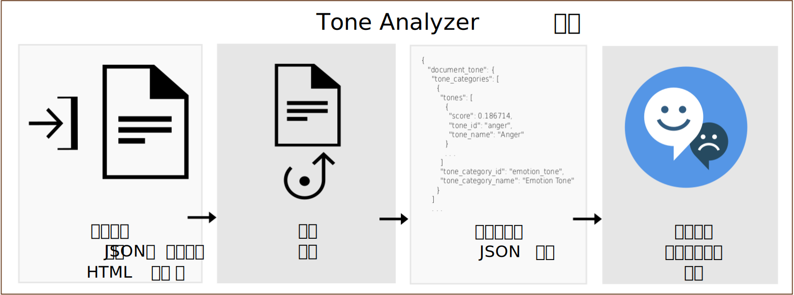

---

copyright:
  years: 2015, 2019
lastupdated: "2019-03-27"

subcollection: tone-analyzer

---

{:shortdesc: .shortdesc}
{:new_window: target="_blank"}
{:tip: .tip}
{:important: .important}
{:note: .note}
{:deprecated: .deprecated}
{:pre: .pre}
{:codeblock: .codeblock}
{:screen: .screen}
{:javascript: .ph data-hd-programlang='javascript'}
{:java: .ph data-hd-programlang='java'}
{:python: .ph data-hd-programlang='python'}
{:swift: .ph data-hd-programlang='swift'}

# 关于
{: #about}

> **服务更新：***{{site.data.keyword.toneanalyzershort}} 服务已经在 2019 年 2 月 22 日进行了更新。现在，服务在 {{site.data.keyword.cloud}} 法兰克福位置 (**eu-de**) 使用基于令牌的 Identity and Access Management (IAM) 认证。有关更多信息，请参阅发行说明中的 [2019 年 2 月 22 日服务更新](/docs/services/tone-analyzer?topic=tone-analyzer-rnrn#February2019)。*

{{site.data.keyword.toneanalyzerfull}} 服务使用语言分析来检测书面文字中的情绪语气和语言语气。该服务可以在文档级别和句子级别分析语气。您可以使用该服务来了解别人如何感知您的书面通信，从而改进您通信的语气。企业可以使用该服务来了解其客户通信的语气，并对每位客户进行相应的响应，或者总体了解和改善其客户对话。
{: shortdesc}

您向该服务提交包含书面内容的 JSON、纯文本或 HTML 输入。该服务最多可接受 128 KB 的文本，大约为 1000 个句子。该服务将返回报告输入语气的 JSON 结果。您可以使用这些结果来提高通信的认知和有效性，从而确保您文字传达给目标受众的语气和风格符合您的预期。下图显示了对该服务的基本调用流程。

## Tone Analyzer 端点
{: #itae}

该服务提供两个端点：

-   **通用端点**（`GET` 或 `POST /v3/tone`）

    使用 {{site.data.keyword.toneanalyzershort}} 通用端点来分析较短的 Web 数据（如电子邮件或推文）或较长的文档（如文章或博客帖子）。监视社交媒体，以了解客户对品牌的看法，并确定向哪些用户发送特定营销信息。该端点接受 JSON、纯文本或 HTML 输入。有关该方法及其返回的语气的更多信息，请参阅[使用通用端点](/docs/services/tone-analyzer?topic=tone-analyzer-utgpe)。

[通用演示 ](https://tone-analyzer-demo.ng.bluemix.net/){: new_window} 将内容提交到服务以进行分析。此服务返回内容语气的整体和句子级别分析。
-   **客户参与端点** (`POST /v3/tone_chat`)

    使用 {{site.data.keyword.toneanalyzershort}} 客户参与端点来监视客户服务和支持对话。在客户对话变得不尽如人意或发现改进客户服务脚本、对话策略和客户历程的机会时，提升客户对话。该端点接受 JSON 输入。有关该方法及其返回的语气的更多信息，请参阅[使用客户参与端点](/docs/services/tone-analyzer?topic=tone-analyzer-utco)。

    [客户参与演示 ](https://customer-engagement-demo.ng.bluemix.net/){: new_window} 分析客户与客户服务代理之间的对话。该服务会测量客户满意度和客户关心的问题并评估代理绩效，从而使您可权衡交互的发展情况。

有关此服务可用的价格套餐的更多信息，请参阅 [{{site.data.keyword.cloud_notm}}“目录”中的 ](https://{DomainName}/catalog/services/tone-analyzer){: new_window} {{site.data.keyword.toneanalyzershort}} 服务。

## 用例
{: #iuc}

以下是服务的一些有趣的用例：

-   *社交倾听和受众监视* - 监视社交媒体，以实时了解客户对您品牌的看法。例如，您可以确定芝加哥的客户在公牛队输掉比赛时感到难过，或者在芝加哥美食节期间他们感到很高兴。（通用端点）
-   *个性化市场营销* - 确定向何人传递个性化营销信息以及何时传递。例如，一家旅游公司可能会向高兴的消费者传递“犒劳你自己”的营销信息，向难过的消费者传递“逃脱”的营销信息，对愤怒的消费者传递“放松”的营销信息。（通用端点）
-   *聊天机器人* - 使自动化代理能够检测客户语气并进行适当的反应。例如，您可能会对悲伤作出“我很抱歉您对此问题感到难过”的反应，或对满意作出“我很高兴您对我们的服务感到满意”的反应。（客户参与端点）
-   *客户参与监视和质量保证* - 监视代理和客户通信的总体语气、检测异常情况并突出就如何更好地通信对代理进行培训的机会。（客户参与端点）

您还可以将 {{site.data.keyword.toneanalyzershort}} 服务与其他 {{site.data.keyword.ibmwatson}} 服务（例如，[{{site.data.keyword.conversationfull}}](https://{DomainName}/docs/services/conversation/index.html) 或 [{{site.data.keyword.speechtotextfull}}](https://{DomainName}/docs/services/speech-to-text/index.html)）一起使用以分析用户输入。例如，[Conversation Food Coach ](https://food-coach.ng.bluemix.net/){: new_window} 应用程序使用 {{site.data.keyword.conversationshort}} 服务来指导用户根据其对进食食物的反应来选择健康的食品。有关更多信息，请参阅此 [{{site.data.keyword.watson}} 博客帖子 ](https://developer.ibm.com/watson/blog/2016/10/17/creating-a-compassionate-conversational-agent-using-watson-tone-analyzer-and-watson-conversation-services/){: new_window}。

{{site.data.keyword.toneanalyzershort}} 服务通过算法计算书面文本的语气。它不会推断文字作者的个性特征。要获取个性描述，请参阅 [{{site.data.keyword.personalityinsightsfull}} 服务 ](https://{DomainName}/docs/services/personality-insights/index.html){: new_window}。
{: note}

## 语言支持
{: #languages}

`/v3/tone` 和 `/v3/tone_chat` 方法可以使用英语 (`en`) 和法语 (`fr`) 来分析内容。这两种方法都可以使用各种语言的本地化内容进行响应。有关更多信息，请参阅[使用通用端点](/docs/services/tone-analyzer?topic=tone-analyzer-utgpe)和[使用客户参与端点](/docs/services/tone-analyzer?topic=tone-analyzer-utco)。

## HIPAA
{: #hipaa}

美国健康保险可移植性和责任法案 (HIPAA) 支持不适用于 {{site.data.keyword.toneanalyzershort}} 服务。服务无状态。它不在 {{site.data.keyword.cloud_notm}} 上存储用户数据。
