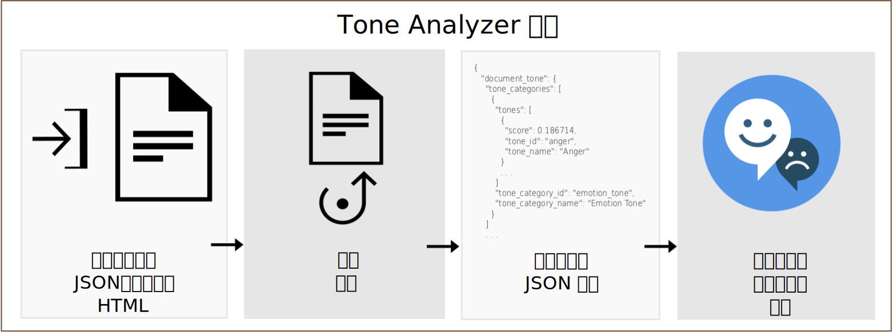

---

copyright:
  years: 2015, 2019
lastupdated: "2019-03-27"

subcollection: tone-analyzer

---

{:shortdesc: .shortdesc}
{:new_window: target="_blank"}
{:tip: .tip}
{:important: .important}
{:note: .note}
{:deprecated: .deprecated}
{:pre: .pre}
{:codeblock: .codeblock}
{:screen: .screen}
{:javascript: .ph data-hd-programlang='javascript'}
{:java: .ph data-hd-programlang='java'}
{:python: .ph data-hd-programlang='python'}
{:swift: .ph data-hd-programlang='swift'}

# 關於
{: #about}

> **服務更新：***{{site.data.keyword.toneanalyzershort}} 服務已於 2019 年 2 月 22 日更新。在 {{site.data.keyword.cloud}} 法蘭克福位置 (**eu-de**)，服務現在使用記號型 Identity and Access Management (IAM) 鑑別。如需相關資訊，請參閱版本注意事項中的 [2019 年 2 月 22 日服務更新](/docs/services/tone-analyzer?topic=tone-analyzer-rnrn#February2019)。*

{{site.data.keyword.toneanalyzerfull}} 服務會使用語言分析來偵測書面文字中的情緒及語言語氣。此服務可以同時分析文件和句子層次的語氣。您可以使用此服務來瞭解他人如何理解您的書面溝通，然後改善溝通的語氣。企業可以使用此服務來了解其客戶溝通的語氣，並適當地回應每一個客戶，或者整體上瞭解及改善他們的客戶交談。
{: shortdesc}

您可以將包含書面內容的 JSON、純文字或 HTML 輸入提交給服務。服務最多可接受 128 KB 的文字（大約 1000 個句子）。服務會傳回報告輸入語氣的 JSON 結果。您可以使用這些結果來提高溝通的認知及有效性，並確保您的撰寫內容傳達您要對適用對象使用的語氣與樣式。下圖顯示呼叫服務的基本流程。

## Tone Analyzer 端點
{: #itae}

服務提供兩個端點：

-   **一般用途端點**（`GET` 或 `POST /v3/tone`）

    使用 {{site.data.keyword.toneanalyzershort}} 一般用途端點，可分析較短的 Web 資料（例如，電子郵件訊息或推文）或較長的文件（例如文章或部落格文章）。請監視社交媒體以瞭解客戶對某個品牌的意見，並決定特定的傳訊要以誰為目標。端點可接受 JSON、純文字或 HTML 輸入。如需它所傳回方法和語氣的相關資訊，請參閱[使用一般用途端點](/docs/services/tone-analyzer?topic=tone-analyzer-utgpe)。

    [一般用途展示 ](https://tone-analyzer-demo.ng.bluemix.net/){: new_window} 會將內容提交給服務，以進行分析。服務會傳回內容語氣的整體及句子層次分析。
-   **客戶參與端點** (`POST /v3/tone_chat`)

    使用 {{site.data.keyword.toneanalyzershort}} 客戶參與端點，可監視客戶服務及支援交談。在客戶交談惡化時呈報客戶交談，或找機會來改善客戶服務 Script、對話策略，以及客戶旅程。端點可接受 JSON 輸入。如需它所傳回方法和語氣的相關資訊，請參閱[使用客戶參與端點](/docs/services/tone-analyzer?topic=tone-analyzer-utco)。

    [客戶參與展示 ](https://customer-engagement-demo.ng.bluemix.net/){: new_window} 會分析客戶與客服人員之間的交談。服務可測量客戶滿意度和考量，並評量客服人員績效，以讓您評估互動的發展方式。

如需服務可用定價方案的相關資訊，請參閱 [{{site.data.keyword.cloud_notm}} 型錄 ](https://{DomainName}/catalog/services/tone-analyzer){: new_window} 中的 {{site.data.keyword.toneanalyzershort}} 服務。

## 使用案例
{: #iuc}

服務的一些有趣使用案例如下：

-   *社群聆聽及對象監視* - 即時監視社交媒體以瞭解客戶對您的品牌的意見。例如，您可能會判斷芝加哥的客戶在公牛隊輸球後很悲傷，或在芝加哥美食節期間很高興。（一般用途端點）
-   *個人化行銷* - 判斷要作為個人化傳訊目標的對象及時間。例如，旅遊公司可能會以高興的消費者作為「獎勵自己」傳訊的目標、以悲傷的消費者作為「脫離」傳訊的目標，並以生氣的消費者作為「放鬆」傳訊的目標。（一般用途端點）
-   *聊天機器人* - 啟用自動化代理程式來偵測客戶語氣及制訂適當的回應。例如，您可能會利用「很抱歉您對這個問題感到沮喪」來回應悲傷，或是利用「很高興您對我們的服務感到滿意」來回應滿意。（客戶參與端點）
-   *客戶參與監視及品質保證* - 監視客服人員與客戶溝通的整體語氣、偵測異常，以及強調顯示機會來訓練客服人員如何更好地進行溝通。（客戶參與端點）

您也可以使用 {{site.data.keyword.toneanalyzershort}} 服務，以分析其他 {{site.data.keyword.ibmwatson}} 服務（例如 [{{site.data.keyword.conversationfull}}](https://{DomainName}/docs/services/conversation/index.html) 或 [{{site.data.keyword.speechtotextfull}}](https://{DomainName}/docs/services/speech-to-text/index.html)）的使用者輸入。例如，[Conversation Food Coach ](https://food-coach.ng.bluemix.net/){: new_window} 應用程式使用 {{site.data.keyword.conversationshort}} 服務，教導使用者根據他們對所吃食物的回應選擇健康的食物。如需相關資訊，請參閱本 [{{site.data.keyword.watson}} 部落格文章 ](https://developer.ibm.com/watson/blog/2016/10/17/creating-a-compassionate-conversational-agent-using-watson-tone-analyzer-and-watson-conversation-services/){: new_window}。

{{site.data.keyword.toneanalyzershort}} 服務會以演算法的方式計算書面文字的語氣。它不會推斷文字作者的人格特質。若要取得人格描述，請參閱 [{{site.data.keyword.personalityinsightsfull}} 服務 ](https://{DomainName}/docs/services/personality-insights/index.html){: new_window}。
{: note}

## 語言支援
{: #languages}

`/v3/tone` 及 `/v3/tone_chat` 方法可以分析英文 (`en`) 及法文 (`fr`) 的內容。這兩種方法都可以使用各種語言的本地化內容來回應。如需相關資訊，請參閱[使用一般用途端點](/docs/services/tone-analyzer?topic=tone-analyzer-utgpe)及[使用客戶參與端點](/docs/services/tone-analyzer?topic=tone-analyzer-utco)。

## HIPAA
{: #hipaa}

「醫療保險轉移和責任法 (HIPAA)」支援不適用於 {{site.data.keyword.toneanalyzershort}} 服務。此服務是無狀態的。它不會將使用者資料儲存至 {{site.data.keyword.cloud_notm}}。
